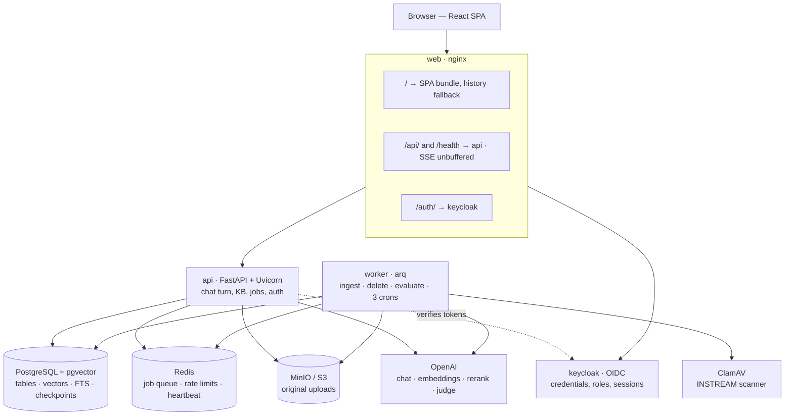
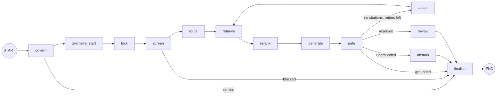
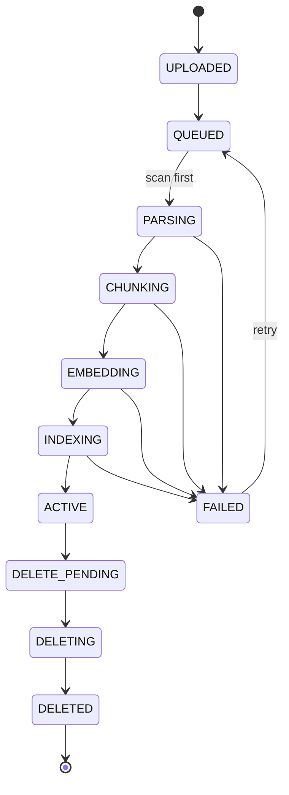

# Architecture

Corpus is an enterprise RAG chatbot: users upload documents, ask questions in a chat, and get
answers that are **grounded** — every claim carries a citation chip that resolves to the passage
it came from, and when the retrieved material does not support an answer the system says so
rather than answering from the model's pre-training.

This document is the engineering account of how it works and **why it is built this way** — the
trade-offs taken, the alternatives rejected, the failure behaviour, and the limits. Companions:
[DATA_MODEL.md](DATA_MODEL.md) · [SECURITY.md](SECURITY.md) · [EVALUATION.md](EVALUATION.md) ·
[DEPLOYMENT.md](DEPLOYMENT.md).

> **On the numbers in this document.** Latencies are medians measured on a developer workstation
> against live OpenAI models, not vendor figures or estimates. They are reported to show the
> *shape* of the budget — which stage dominates, and what a change would actually buy. Your
> absolute numbers will differ; the proportions are the point.

---

## 1. Design principles

Six rules the codebase actually holds itself to. Each one has cost the design something, which is
how you can tell it is real.

| Principle | What it means here |
|---|---|
| **Ground or abstain** | An answer is served only if it cites supplied passages. There is no "best effort" mode, and no configuration switch that turns grounding off. |
| **Fail in the direction that preserves correctness** | Every component declares whether it fails *open* (degrade and continue) or *closed* (refuse). The direction follows from what the degraded output would be — see §7. |
| **Never trust a model's output as control flow** | Citation markers are resolved against a supplied list, not followed. The router returns a *class*, never a strategy. Rerank scores are clamped and bounds-checked. |
| **Untrusted text never enters the instruction channel** | Retrieved document text is fenced in a non-system message with delimiters neutralised — including filenames, which read like metadata and are attacker-chosen. |
| **Make invariants structural, not remembered** | `finalize` is the only edge to `END`, so "the lock is always released" is a property of the graph's shape. The telemetry record is a frozen dataclass of scalars, so "no payload text" is unrepresentable rather than a rule someone must recall. |
| **Measure before tuning** | Batch shapes, thresholds and model tiers in this system were chosen by running them. Where a number is still provisional, it says so in the code. |

---

## 2. System topology



**Same origin is a design constraint, not a convenience.** The API ships **no CORS middleware**
and the refresh-token cookie is `SameSite=strict`; both are only coherent because one reverse
proxy fronts the SPA and the API. The development server reproduces the same arrangement with a
proxy. Moving the SPA to a second origin does not "just need CORS" — it changes the session
security model, and the cookie policy would have to be relaxed to match.

---

## 3. Deployables

| Deployable | Process | Scales by | Notes |
|---|---|---|---|
| **api** | `uvicorn app.main:app` | replicas | Stateless. Runs the RAG graph inline for a turn. |
| **worker** | `arq workers.main.WorkerSettings` | processes | Ingestion, deletion, evaluation, plus three cron jobs. |
| **web** | nginx | replicas | Built SPA + the reverse proxy. |

`api` and `worker` are **the same image with different commands** — one dependency resolution, one
build, no possibility of the two halves drifting on a library version. The bootstrap
(`alembic upgrade head`, the checkpointer tables, the object-storage bucket) is a third command on
that same image, run as a one-shot service.

**The worker runs no HTTP server**, which is why its readiness is reported *by the API* at
`/health/ready/worker`: the API reads the heartbeat key arq maintains in Redis with a TTL. A
consequence worth knowing before you build alerting: a worker deployable cannot be probed unless
the API is reachable.

**Ingestion throughput scales with worker processes, not with `WORKER_MAX_JOBS`.** That was
measured: concurrent jobs inside one worker do not overlap the CPU-bound swap phase, and a single
process showed a ~19 s head-of-line block behind a large document.

---

## 4. Anatomy of a chat turn

A turn is a [LangGraph](https://langchain-ai.github.io/langgraph/) state machine checkpointed to
PostgreSQL. `thread_id` is the conversation id for the life of the conversation.



| Stage | Responsibility | On failure | Key settings |
|---|---|---|---|
| `govern` | Ownership check. A conversation belongs to its owner; an administrator gets `404`, not a read. | denies | — |
| `telemetry_start` | Opens the turn record and binds `(conversation_id, turn_index)` to the log context. | — | — |
| `lock` | Per-user processing gate — a row in `processing_locks`, not Redis. | **open** (advisory) | `GRAPH_LOCK_TTL_SECONDS` 180 |
| `screen` | Prompt-injection screening of **the query only**. | **closed** | `GRAPH_SCREEN_ENABLED` |
| `route` | One schema-constrained call classifying the query *and* generating derived probes. | **open** → plain hybrid | `ROUTER_MAX_SUB_QUERIES` 3 |
| `retrieve` | Hybrid search per probe, fused; then a second fusion pass across probes. | **closed** | `RETRIEVAL_*` |
| `rerank` | Batched pointwise LLM scoring of merged candidates. | **open**, publishes no score | `RERANK_TOP_K` 8 |
| `generate` | Streams the answer into a server-side buffer with `[S<n>]` citation markers. | **closed** | `LLM_MAX_OUTPUT_TOKENS` 1500 |
| `gate` | Structural groundedness check. No I/O, no model call. | **closed** | `GATE_MIN_GROUNDEDNESS` 0.5 |
| `adapt` | The single back edge: one re-retrieval with a hypothetical-document probe. | — | `GRAPH_MAX_RETRIES` 0 |
| `abstain` | A terminal **node**, not an edge to `END` — an abstention is a response, and is persisted. | — | — |
| `finalize` | Writes the message, releases the lock, closes telemetry, enqueues evaluation. | must not raise | — |

Three structural properties hold the whole thing together:

- **`finalize` is the only edge to `END`.** Denial, injection block, abstention, exhausted retry
  and node exceptions all route through it. "The lock is always released and telemetry always
  closed" is therefore a property of the graph's shape rather than of discipline.
- **Nothing reaches the client before the gate passes.** The SSE stream carries contentless
  `stage` frames, then one complete verified answer. There is deliberately no token-by-token
  streaming: you cannot un-say an ungrounded sentence a user has already read.
- **Every channel is reset per turn.** A thread is a *checkpoint lineage, not a variable scope*,
  so any state a run does not seed still holds the previous turn's value. Adding a state field
  means adding it to the per-turn reset, and two drift tests fail if you forget.

### 4.1 Latency budget

Where a turn's time actually goes, measured on the development machine against live models:

| Stage | Median | Notes |
|---|---|---|
| `route` | **~840 ms** | `gpt-4o-mini`, one call, classification + probes together |
| `retrieve` | ~200–600 ms | overlapped with `route` — see below |
| `rerank` | **~1,520 ms** | batch 5 × concurrency 10; 2,090 ms at 10×5, 3,579 ms at 25×2 |
| `generate` | **~1,816 ms** | at the real 8-chunk grounding shape |
| `gate` | **~39 µs** | structural; asserted by a test that it performs no database work |
| **to first byte** | **≈5–6 s** | the gate is before the client, so this is the honest number |
| evaluation | ~5.9 s | **after** the answer is served, in the worker — never on the user's clock |

**The original query's retrieval arm runs concurrently with the router call.** Derived probes are
*additive* — the query is always searched, whatever the router concludes — so that arm depends on
nothing the router produces. Measured: a zero-probe turn went **1,400 → 891 ms** across those two
stages, with the retrieval arm entirely hidden behind the router call.

Reading the budget honestly: **rerank and generate dominate**, and both are model calls. Shaving
retrieval would buy almost nothing. That is why `GRAPH_MAX_RETRIES` ships at `0` — a retry costs
another full ~4.6 s for a second pass over passages that, when measured, were no better.

---

## 5. Retrieval

### 5.1 Hybrid search and fusion

Two arms over the same chunk table, fused by **Reciprocal Rank Fusion** (`RETRIEVAL_RRF_K = 60`):

- **Dense** — pgvector HNSW cosine over `text-embedding-3-large` (3,072 dims), 50 candidates.
- **Sparse** — PostgreSQL full-text `ts_rank_cd`, 50 candidates.

RRF rather than a weighted score blend, because cosine distance and `ts_rank_cd` are on unrelated
scales and `ts_rank_cd`'s range moves with the query. A weighted blend needs a per-query
normalisation that silently re-tunes itself as the corpus grows — a knob that looks tuned and
isn't.

**The lexical arm is PostgreSQL FTS, not BM25**, and this is a recorded deviation rather than an
oversight: no IDF weighting and no length saturation. It was taken to avoid requiring a
third-party PostgreSQL extension on every deployment target. It meets the intent — a lexical arm
that catches acronyms, part numbers and error codes that an embedding blurs — and cover density
supplies phrase sensitivity. The revisit trigger is explicit: a corpus where lexical ranking is
*measurably* the bottleneck.

Two implementation details that are easy to get wrong and cost nothing to get right:

- Both indexes are **functional**, so a query must reproduce the expression exactly — the dense arm
  orders on the `embedding::halfvec(3072)` cast, and the text-search configuration is inlined
  rather than bound. Get either wrong and PostgreSQL returns *identical rows by sequential scan*:
  correct answers, orders of magnitude slower, nothing failing.
- The tsquery **ORs** its terms. `plainto_tsquery` ANDs, and a normal-length question then matches
  nothing at all.

### 5.2 Query routing

`FR-RET-03` names five query classes. Three of them — rewrite, decomposition, hypothetical document
— are **generative**, so in-tree pattern rules could only ever emit the default. Routing is
therefore one schema-constrained model call on a cheap model that returns a **class and probes,
never a strategy**: the class→strategy mapping is a requirement, so it lives in our code as a dict.

Derived probes are **additive and capped** (3 probes, 400 chars each, truncated rather than
rejected). The original query is always searched. That single decision means an empty probe list
means "just the query", a bad rewrite cannot remove the original signal, and HyDE needs no special
case anywhere downstream — its passage is simply another probe.

Probes are fanned out with `asyncio.gather` **inside** the node over one session each, and merged
by a **second RRF pass** with every probe weighted equally. Consequence worth flagging: the merged
score accumulates with probe count, so it is comparable *within* a turn only. Nothing may threshold
on it.

### 5.3 Reranking

`RERANK_TOP_K = 8` passages, selected by **batched pointwise LLM scoring** over the merged
candidates. It is **not a cross-encoder**, which is what the requirement's wording implies, and the
reason is worth stating: a local cross-encoder means torch/onnxruntime and a runtime weight
download; a hosted reranker means a second model vendor, key and outage surface. Both were
declined in favour of the model client already in the tree.

It **fails open and publishes no score**. The invariant is that `rerank_scores` is *empty or exactly
as long as* the passage list — never partially filled, because the alternative is inventing a
number for a field the user sees. The UI therefore renders a citation card with no score, and that
is a normal state rather than a degraded one.

Batch shape was measured, not chosen: 5 passages per call at concurrency 10 (1,520 ms) beat 10×5
(2,090 ms) and 25×2 (3,579 ms).

### 5.4 Scope: what a query is allowed to see

Access control is **evaluated in SQL, from the live request context, on every turn** — never from
anything carried in a checkpoint. Two layers:

- **Ambient scope** — an in-query predicate over knowledge bases: global-to-this-user, or attached
  to *this* conversation. An owner-only filter is not sufficient, because every chat has its own
  knowledge base, so it would expose every other chat's attachments.
- **`@`-mentions narrow, never widen.** They are AND-ed with the ambient scope, so a
  client-supplied document id cannot reach outside it, and a mention of an out-of-scope document
  retrieves nothing rather than something.

---

## 6. Grounding: the citation contract

This is the part that makes the product what it is, so it is specified end to end.

1. The prompt supplies passages as an ordered list and asks the model to cite with `[S<n>]`.
2. `[S<k>]` resolves to the *k*-th passage of that supplied set **by construction** — never by a
   lookup the model can influence.
3. A marker addressing a source that was not supplied is **dropped from the answer text**.
   Resolving it is precisely what the grounding requirement forbids; rendering it would be a dead
   chip.
4. The answer is split into segments on those markers by **one parser**, shared by the gate, the
   persistence step and the evaluator. Two parsers is how the chip a user hovers stops matching the
   passage the gate approved.
5. Segment `quote`, `doc`, `page` and `score` are read from the chunk rows **at persist time**, not
   from the model.
6. The citation quote is **denormalised into the message**, because a document may be replaced or
   deleted later and a transcript must stay readable. The corollary is a rule: nothing may resolve
   a citation by chunk id.

**The gate** measures the fraction of substantive claim sentences that are covered by a citation,
and abstains below `GATE_MIN_GROUNDEDNESS = 0.5`. It does no I/O and makes no model call, which is
what lets it sit in front of the user without adding to the wait.

Its coverage rule is **block-scoped**, and that detail came from measurement rather than design: a
per-sentence rule scored genuinely grounded answers at 0.25–0.5 and would have abstained on 2 of 12
correct answers, because real models write three sentences from one passage and cite once at the
end. Block-scoped, the same corpus scored 12/12 at 1.00 with both unanswerable questions at 0.00.

**The gate's known limitation is stated rather than hidden**: it measures *that the model cited*,
not *that the passage supports the claim*. A fabricated answer citing a real in-scope passage
passes it — reproduced deliberately, and exactly what the post-hoc judge exists to catch. The two
disagreeing is signal, not a bug; see [EVALUATION.md](EVALUATION.md) §3.

---

## 7. Failure semantics

**Every component declares a failure direction, and the direction follows from what the degraded
output would be** — not from how important the component feels.

| Fails **open** (degrade, continue) | Because the degraded output is defensible |
|---|---|
| `route` | Its own default *is* plain hybrid search. A quality optimisation that can turn a healthy turn into an error is worse than not shipping it. |
| `rerank` | The fused order is a reasonable ranking; the honest response is to publish no score. |
| `lock` | Advisory by design: expiry mid-turn degrades UX, never correctness. |
| Rate limiter | A limiter that takes the product down when its store blips is worse than the abuse it prevents. |
| Evaluation | Runs after the answer was served. Its degraded output is "no score chips", which the UI already renders. |

| Fails **closed** (refuse) | Because the degraded output would be a lie |
|---|---|
| `screen` | A security control that fails open is not a control. |
| `retrieve` | No passages means no grounding. One exception: a *derived probe* may fail where the original query may not. |
| `generate` | An empty answer is a failure, not an abstention — dressing provider silence up as one reports an outage as a grounded reply. |
| `gate` | It is the last thing between ungrounded text and a user. |
| Malware scanner | An unreachable clamd fails the ingestion job, retryably. |

Runtime failures are classified into a **closed set of five** — `LLM_ERROR`,
`RETRIEVAL_UNAVAILABLE`, `RATE_LIMITED`, `TIMEOUT`, `SYSTEM_FAILURE` — admitted only where the class
changes what the user should *do*. An errored turn is **served but never stored**: persisting error
copy into the transcript would charge it against the conversation's token budget, so a run of
provider errors would consume the chat.

There are deliberately **no feature flags for the controls that carry a requirement**. There is no
`GATE_ENABLED` and no `TELEMETRY_ENABLED`, because their "off" state would remove a guarantee
rather than degrade a feature. `EVAL_ENABLED` exists precisely because *its* off state is sanctioned.

---

## 8. Concurrency, idempotency and resume

A checkpointed run can span a process restart, so the awkward cases are designed for rather than
hoped about.

- **`finalize` is idempotent on resume.** Two different database drivers are in play and can never
  be atomic together, so it checks whether the answer row exists before inserting one.
- **No node has a side effect before its interrupt or failure point**, because an interrupt
  re-executes the whole node.
- **Regenerate writes in place**, replacing content and citations **together** in one update, and
  clearing the evaluation and feedback in that same statement. An old citation envelope beside new
  text would validate against the wrong grounding set — and pass.
- **Jobs are at-least-once.** A redelivered ingestion detects it is stale from the version on the
  job row and refuses to roll a pointer backwards.
- **Version swaps are one transaction.** A crash between writing chunks and marking the document
  active cannot orphan vectors — asserted by a test rather than assumed.
- **The processing lock is per user, last-writer-wins, released by token match**, so two
  overlapping turns compose in either finishing order. Expiry is the only crash release; there is
  no sweeper, and that is a deliberate simplification the advisory semantics permit.

---

## 9. Ingestion



The synchronous half does only what must be durable before a `202`: magic-byte type detection
(never the extension), size limits enforced **during** the read, checksum deduplication, store the
original, write rows, enqueue.

The worker does the rest, scanning **before** parsing so untrusted bytes meet the scanner first.

**Re-ingestion is incremental, and the ordering is the interesting part** — copy, swap, collect:

1. Write the new version as a *complete* chunk set at a new version number.
2. Copy unchanged vectors **database-side**, matched on `embedding_fingerprint` — unchanged text
   costs zero embedding calls.
3. Commit at `ACTIVE`, so the previous version keeps answering right up to the swap.
4. Delete superseded rows **inside that same transaction**, so there is never a window in which
   both versions are searchable. A post-commit delete leaves one, and a worker crash makes it
   permanent and silent.

Chunks are cut **within a parsed block and never across one**, which preserves the citation locator
and means a localised edit re-embeds one block rather than the document.

Status reaches the GUI over SSE, and the change source is **per-connection database polling rather
than a worker publish**. That looks like the lazy choice and is the considered one: a
crash-stalled document emits no event *by definition*, so any push design needs a timer beside it
anyway — leaving the push path as extra machinery with a lost-publish failure mode that strands a
row on screen forever. Polling re-reads the truth, so a missed tick self-heals.

A consequence for anyone building on it: **polling samples state.** A fast ingestion has been
observed going `QUEUED → INDEXING → ACTIVE` with three stages completing inside one poll interval,
so the UI renders whatever arrives and never assumes it will see each stage.

---

## 10. Observability

One `TurnRecord` is built in `finalize` and handed to every sink — the log event, the durable
`turn_telemetry` row, and an optional OpenTelemetry span. That is how the three agree: **not two
writers agreeing, but one value**.

- It is a **frozen dataclass of ids and scalars**, so "no prompt or answer text, ever" is
  unrepresentable rather than a rule to remember.
- `structlog` binds `(conversation_id, turn_index)` to the whole turn via `contextvars` — the pair
  rather than a minted run id, because it survives a resume and is what the durable row carries, so
  stream and table join with no translation. The HTTP request id is a separate scope, since a run
  outlives its request.
- **One span per closed turn, not a span tree**, and that is forced rather than lazy: a checkpointed
  run can span a process restart, so there is nothing to hold a live parent span in.
- **No LangSmith or Langfuse SDK.** Both work by wrapping the model client and exporting prompt and
  completion text. Corpus emits OTLP-compatible spans instead, off by default — adopting a vendor
  later is a collector endpoint, not a code change.

`turn_telemetry` has **no foreign keys**: an operator's error-rate history must not be
cascade-deletable by the users it measures.

---

## 11. Security posture

Full treatment in [SECURITY.md](SECURITY.md). The architectural shape:

- **Keycloak owns identity.** Backend-mediated ROPC; RS256 validated against the realm JWKS with
  issuer, audience and authorized-party all checked. No password hashing in this codebase.
- **The refresh token has exactly one channel** — an httpOnly, `Secure`, `SameSite=strict` cookie
  scoped to the auth routes. Not in the response body: a cookie set beside a body copy protects
  nothing.
- **Authorization is a query predicate**, evaluated per request. Foreign resources answer `404`,
  including for administrators, so no route becomes an existence oracle.
- **Prompt-injection defence is structural first**: one instructions-only system message, untrusted
  text fenced and neutralised, the query last and separate. The pattern screen in front of it is
  acknowledged as evadable — which is *why* the structural control carries the requirement.
- **No tools are exposed to the model.** The grounding contract self-checks. Both are what make the
  "must not alter tool use or authorization" property hold by construction.

---

## 12. Scaling and capacity

| Dimension | Current shape | First thing that breaks |
|---|---|---|
| Chat concurrency | stateless api replicas | OpenAI rate limits, then the per-user processing lock |
| Ingestion | worker processes | embedding throughput; the swap is a CPU-bound serial section |
| Corpus size | pgvector HNSW, `ef_search` 100 | recall at very large corpora — the documented upgrade path is a dedicated vector store behind the existing repository interface |
| Conversation length | 10.4 K token budget, 1.5 K reserved for the answer | the conversation freezes and the user starts a new chat — a *designed* terminal state, not a fault |
| Storage | 50 MB/file, 10 GB/user | quota enforcement is best-effort under concurrency, by design |

The conversation budget deserves a note, because it is the most visible product limit: it counts
**history plus the current query only** — not retrieved chunks, not the system prompt, which are
bounded separately by the rerank top-K. So the meter means *conversation length*, and the real
prompt legitimately exceeds it. Raising `CONTEXT_WINDOW_TOKENS` is one environment variable, and
the meter's denominator follows honestly.

---

## 13. Design decisions and rejected alternatives

The table that matters most to a reviewer: **what was considered and turned down.**

| Decision | Rejected | Why |
|---|---|---|
| pgvector inside PostgreSQL | Milvus / dedicated vector DB | One store means a document and its vectors commit or roll back together. Kept behind a repository interface so the swap stays configuration. |
| RRF fusion | weighted score blend | Unrelated scales; the weight needs a per-query normalisation that re-tunes itself as the corpus grows. |
| PostgreSQL FTS | BM25 extension | Avoids a third-party extension on every deployment target. Recorded as a deviation with a measurable revisit trigger. |
| LLM pointwise rerank | local cross-encoder; hosted reranker | torch + a runtime weight download; or a second vendor, key and outage surface. |
| History rehydrated from rows | LangGraph message channel | A channel is re-serialised in full at every superstep, and regenerating an answer would feed the superseded text to the model forever. |
| Processing lock in PostgreSQL | Redis | Redis is not otherwise on the synchronous request path; PostgreSQL already is. A Redis gate adds a request-path dependency that fails exactly when infrastructure is unhealthy. |
| Buffer then gate | token-by-token streaming | You cannot retract an ungrounded sentence a user has already read. The cost is an honest ≈5–6 s to first byte. |
| SSE by polling | worker publish / LISTEN-NOTIFY | A stalled document emits no event by definition, so a timer is required regardless; polling self-heals a missed tick. |
| arq | Celery + RabbitMQ | Routing and dead-letter machinery this workload does not need. Documented as the upgrade path. |
| `fetch` + `ReadableStream` | `EventSource` | `EventSource` cannot set an `Authorization` header, and a token in a query string lands in access logs and history. |
| No download/preview endpoint | file serving | Corpus never re-serves an uploaded byte, which is what keeps signature scanning defence-in-depth rather than the last line. |
| Feedback as a measurement | a tuning loop on 👍/👎 | A thumb is one bit over a confounded event, its direction is ambiguous, and these are safety controls — a loop would let users switch off grounding by disliking answers. |
| Two roles | four-tier role model | The only capability it bought — delegated account creation — already exists in Keycloak, where user management lives. |

---

## 14. Deliberate absences

Things a reviewer might expect and will not find:

- **No CORS middleware** — single origin (§2).
- **No download, presigned-URL, export or preview endpoint.**
- **No in-process job fallback.** Parsing and scanning must be isolated from the API process.
- **No automatic re-embedding trigger.** Changing the embedding model correctly invalidates every
  stored fingerprint, but nothing re-drives a healthy corpus — a fleet-wide re-embed is a cost
  event, not a side effect. The operator-facing trigger is tracked work, not an oversight.
- **No agent tool-calling.** The model retrieves and writes; it does not act. That is what makes
  several security properties hold by construction rather than by policy.

---

## 15. Known limitations

Stated plainly, because a document that lists none is not describing a real system:

1. **Groundedness is structural, not semantic** (§6) — mitigated by post-hoc judging, not solved.
2. **Judge scores are indicative, not exact.** Two frontier judges disagree by ≥0.25 on about a
   fifth of scores. The UI says so.
3. **Single-tenant scoping.** Isolation is per user; the schema carries a tenant column but there
   is no multi-tenant administration surface.
4. **Role revocation has two clocks** — account disablement is immediate, a role change waits for
   token expiry (~5 min). To remove access now, disable the account.
5. **Prompt-injection screening is evadable** by construction; the structural controls carry the
   requirement.
6. **A prior assistant answer re-enters the next turn as trusted speech**, outside the fence.
   Bounded by that answer having itself been gated.
7. **Quota enforcement is best-effort under concurrency.**
8. **No CI.** Suites are comprehensive and run locally; there is no pipeline enforcing them.

---

## 16. Repository map

```
backend/
  app/
    api/           FastAPI routes — one module per resource
    auth/          Keycloak client, JWKS, token validation, principals
    db/            models, repositories, Alembic migrations
    ingestion/     parsers, chunker, incremental diff/swap, scanner
    rag/           graph, state, retrieval, fusion, rerank, generation,
                   citations, groundedness, prompts, evaluation, telemetry
    security/      prompt injection, content validation, rate limits
    services/      object storage, LLM + embedding seams, jobs, health,
                   checkpointer, locks, document events, cloud import
  workers/         arq entrypoint, tasks, cron retention jobs
  evals/           offline golden-set harness
  tools/           spec cross-reference, feedback calibration
  tests/           unit, route, scenario, security suites
frontend/
  src/             React app — components, stores, generated API client
  e2e/             Playwright end-to-end journey
  fidelity/        headed visual-fidelity harness
deployment/        compose stacks, nginx, Keycloak realm, ClamAV config
docs/              this document and its companions
```

---

## 17. Stack

**Backend** — Python 3.14 · FastAPI · LangGraph · SQLAlchemy 2 (async) + asyncpg · Alembic · arq ·
aioboto3 · PyMuPDF / python-docx / markdown-it-py / stdlib `csv` · structlog · slowapi · deepeval ·
openai. Dependencies resolved with [uv](https://docs.astral.sh/uv/) and pinned by `uv.lock`.

**Frontend** — React · Vite · TypeScript. Request and response types are generated from the API's
OpenAPI document; both the document and the generated client are committed, and the frontend image
regenerates the second from the first, so a route that changed without the client being regenerated
fails the build.

**Models** — OpenAI throughout: `gpt-4o` for generation and judging, `gpt-4o-mini` for routing and
reranking, `text-embedding-3-large` for retrieval. Every call goes through one client seam, which
is what allows a deterministic fake backend for the test suite and keeps the vendor swappable.

Source layout and per-half conventions: [`backend/README.md`](../backend/README.md) ·
[`frontend/README.md`](../frontend/README.md).
