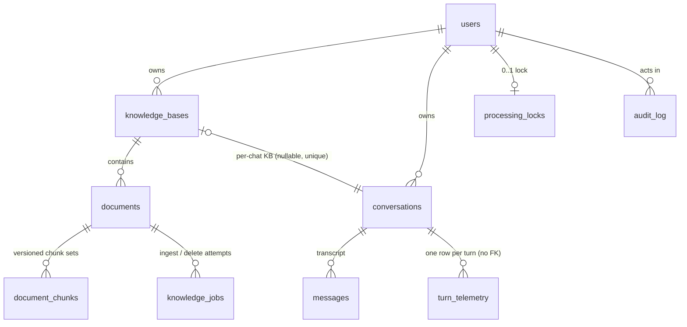

# Data model

One PostgreSQL database holds everything: users, documents, chunk text **and** their vectors,
full-text indexes, conversations, jobs, audit and telemetry. There is no separate vector store —
pgvector lives inside the same database, so a document and its embeddings commit or roll back
together.

Definitive source: `backend/app/db/models/` (SQLAlchemy) and
`backend/app/db/migrations/versions/` (Alembic). This document explains the shape, the decisions
behind it, and the parts that are not obvious from a column list.

---

## 1. Two owners, one database

| Owner | Tables | Created by |
|---|---|---|
| **Alembic** | the ten application tables below, plus `alembic_version` | `alembic upgrade head` |
| **LangGraph** | `checkpoints`, `checkpoint_blobs`, `checkpoint_writes`, `checkpoint_migrations` | `python -m app.services.checkpointer` |

**The checkpointer's tables are not Alembic's, and this trips people up on first deploy.**
`alembic upgrade head` does not create them, and without them the first chat request raises
`CheckpointerNotProvisionedError`. The migration environment excludes them from autogenerate, so
Alembic will never try to adopt or drop them. Both steps run in the `init` service of the
production stack; both are idempotent and must be re-run on every deploy.

Provisioning is a deliberate bootstrap rather than lazy-on-first-use for three reasons, any one
sufficient: `CREATE INDEX CONCURRENTLY` cannot run inside a transaction; two API replicas would
race the library's own migration table; and the API process should not hold DDL rights at all.

## 2. Entities

A knowledge base is either **global to a user** or **attached to one conversation**
(`knowledge_bases.conversation_id`, nullable and unique). That single nullable column is what makes
"this chat only" attachments expressible without inventing a second scoping mechanism — and it is
also why a retrieval filter on `documents.owner_id` alone would be wrong: every chat has its own
knowledge base, so an owner-only predicate sees every *other* chat's attachments too.

## 3. Tables

**`users`** — `id, email, display_name, is_active, created_at`.
A *mirror*, not a credential store: Keycloak owns passwords, roles and sessions. There is
deliberately **no role column** — the role is a token claim, which is what produces the
two-clock revocation behaviour documented in [SECURITY.md](SECURITY.md) §3. `email` is unique,
which is why re-importing the realm and minting a fresh subject id for the seeded administrator
strands the old row.

**`knowledge_bases`** — `id, tenant_id, owner_id, name, visibility, conversation_id, …`.

**`documents`** — 18 columns. `status` is the ingestion lifecycle (11 states); `searchable` and
`deleted_at` are what retrieval filters on; `current_version` is the pointer retrieval pins to;
`size_bytes` feeds the per-user quota; `checksum_sha256` is identity for deduplication.
The checksum uniqueness constraint is **partial** (`uq_documents_knowledge_base_id_checksum_sha256_live`,
`WHERE deleted_at IS NULL`) — without that, re-uploading a file you previously deleted collides
with its own tombstone and the upload fails with a server error.

**`document_chunks`** — 13 columns, the retrieval table and the only one that grows with corpus
size × chunking granularity. `chunk_text` and `embedding` (`VECTOR(3072)`) sit side by side;
`document_version` + `chunk_index` give a chunk identity within a version, enforced by
`uq_document_chunks_document_id_document_version_chunk_index`; `metadata` (JSONB) carries the
citation locator — page for PDF, section for DOCX/Markdown, row range for CSV.
`chunk_hash` is the hash of the text **only** and is deliberately **not unique within a document**
(a repeated paragraph is a legitimate repeat); `embedding_fingerprint` is what the incremental diff
keys on.

**`knowledge_jobs`** — one row per ingestion or deletion attempt: `job_type`, `status`, `progress`,
`attempt_count`, `idempotency_key` (unique), `error_code`, `document_version`. The build target
travels on `document_version`, which is what lets a redelivered job detect it is stale.

**`conversations`** — `title`, `archived`, `kb_selections` (JSONB), and a deterministic ordering
column. `id` doubles as the LangGraph `thread_id`, for the life of the conversation.

**`messages`** — `role, content, citations, evaluation, feedback, model_name, prompt_tokens,
completion_tokens, latency_ms, seq`.
`citations` is a JSONB envelope of answer segments: text interleaved with resolved citations
carrying document id, locator, quoted passage and rerank score. `evaluation` holds judge scores;
`feedback` holds the user's thumb. They are different facts and never overwrite one another — a
human thumb is not a judge score.

**`processing_locks`** — `owner_id` (primary key), `conversation_id`, `token`, `expires_at`.
One row per user. Advisory: `expires_at` is the only crash release and there is no sweeper.

**`audit_log`** — `actor_id, event_type, target_type, target_id, details (JSONB), created_at`,
indexed on the actor and on `(event_type, created_at)`.

**`document_figures`** — one row per figure extracted from a page (FR-ING-09), keyed by
`(document_id, document_version)` exactly as chunks are: `page_number`, `figure_index`,
`content_sha256`, `storage_uri`, `caption`, the four `bbox_*` floats, `width_px`/`height_px`,
`byte_size`. **Derived presentation data, not corpus data** — it carries no text into retrieval,
takes no embedding, and is no part of `embedding_fingerprint`, which is why enabling extraction
forces no re-embed. The object key is the figure's **content hash rather than its ordinal**, so two
identical crops in one version share one object and a re-ingestion producing the same crop
overwrites it with the same bytes. The rasters live under the version prefix in object storage, so
R-36's version swap and R-39's deletion purge them with everything else — nothing new collects them
because nothing new has to.

**`model_overrides`** — `slot` (primary key), `model_id`, `updated_by`, timestamps. One row per
runtime model slot that an operator has overridden; environment configuration is the default and a
row is the override (R-83). Deliberately excludes embeddings, whose model is an
`embedding_fingerprint` input — changing that one is T-608's controlled rebuild, not a slot flip.

**`turn_telemetry`** — one row per turn that *ran*: ids, outcome, error code, model, token counts,
latency, groundedness. Indexed three ways — by `created_at` for retention, by
`(conversation_id, created_at)` for a single conversation's history, and by
`(outcome, created_at)` for the error-rate question an operator actually asks.

## 4. Vectors and full-text search

Two functional indexes on `document_chunks`, and both are functional for a reason:

| Index | Expression |
|---|---|
| `ix_document_chunks_embedding` | HNSW over `embedding::halfvec(3072)` — the **cast** |
| `ix_document_chunks_chunk_text_fts` | GIN over `to_tsvector(<config>, chunk_text)` |

**Because both are expressions, a query must reproduce the expression exactly.** Order on the raw
column instead of the `halfvec` cast, or bind the text-search configuration as a parameter instead
of inlining it, and PostgreSQL silently falls back to a sequential scan — returning *identical
rows*, orders of magnitude slower, with nothing failing anywhere. This has happened in this
codebase and is the single most expensive class of mistake in the schema.

`halfvec` rather than full `vector` in the index because **pgvector's HNSW supports at most 2,000
dimensions for `vector`**, and the embeddings are 3,072 — so the index is not buildable otherwise.
Half precision costs negligible recall at this dimensionality. The column itself stays full
`VECTOR(3072)`; only the index expression is narrowed, which is exactly why the query must order on
the same cast (above).

`VECTOR(3072)` is pinned to the embedding model's dimensionality. Moving to a model of a different
size is a **migration**, not a setting change — and it invalidates every stored fingerprint (§5).

Retrieval is hybrid: cosine distance and `ts_rank_cd`, fused by Reciprocal Rank Fusion. The lexical
arm is **PostgreSQL FTS, not BM25** — no IDF weighting, no length saturation — a recorded deviation
taken to avoid requiring a third-party extension on every deployment target. See
[ARCHITECTURE.md](ARCHITECTURE.md) §5.1.

## 5. Chunk identity across versions

Re-ingesting a document does **not** mutate its chunk rows in place. The sequence is
**copy → swap → collect**, and the ordering is the whole design:

1. Write the new version as a *complete* chunk set at a new `document_version`.
2. Copy unchanged vectors **database-side** (`INSERT … SELECT`, matched on
   `embedding_fingerprint`) — unchanged text costs zero embedding calls and zero egress.
3. Commit at `ACTIVE`, so the previous version keeps answering right up to the swap.
4. Delete the superseded rows **inside that same transaction**.

Step 4 being *inside* the transaction is a correction to an earlier design and matters: retrieval
carries no `document_version` predicate of its own, so a post-commit delete leaves a window where
both versions are searchable — duplicated near-identical chunks eat two rerank slots and render two
citations to one passage. With no sweeper anywhere in the system, a worker crash in that window
made the duplication *permanent and silent*.

`embedding_fingerprint` folds in the chunk text **and** the settings that produced it — the
embedding model plus the chunker's sizing knobs (`CHUNKER_TARGET_CHARS`, `CHUNKER_OVERLAP_CHARS`,
`CHUNKER_MIN_CHARS`, `CHUNKER_BOUNDARY_FLOOR_RATIO`) via `chunking_version`. Re-tuning any of them
therefore invalidates the affected vectors *by construction* rather than by remembering to. **This
costs money**, which is why those are documented as quality settings rather than limits.

**Accepted consequence:** superseded versions are unreconstructable, and a replaced document's
historical chunk id dangles by design. That is only safe because the citation quote is denormalised
into `messages.citations` — so the rule that follows is absolute: *nothing may resolve a citation by
chunk id.*

## 6. Retention

| Data | Policy | Setting |
|---|---|---|
| Graph checkpoints | keep newest 3 per thread, nothing younger than 3600 s; collect orphaned threads | `CHECKPOINTER_RETENTION_*` |
| `turn_telemetry` | 90-day horizon, daily batched sweep | `TELEMETRY_RETENTION_DAYS` |
| `messages.evaluation` | **none** — scores live and die with the message | — |
| `audit_log` | none — a compliance decision, deliberately not defaulted | — |

**Checkpoint growth is the one that surprises people, so it was measured rather than estimated:**
8,031 checkpoints and 36,451 write rows across 547 threads — **45.8 MB** — for a development
corpus, at roughly 24 checkpoints per short conversation. Only the latest is ever read. After
pruning: **813 checkpoints, 3,822 writes (~90% removed)**. On-disk size does not drop until
autovacuum, which is correct — the deliverable is *bounded growth*, not a smaller file.

Two details worth carrying:

- **The age floor, not the count, is the load-bearing guard.** It is what stops a burst of
  supersteps evicting the checkpoint a live turn is about to resume from.
- **Blobs are deleted by set difference against survivors.** `checkpoint_blobs` carries no
  `checkpoint_id`, and the second-newest checkpoint was measured sharing 33 of 38 channel/version
  pairs with the newest — so deleting an old checkpoint's blobs naively corrupts the one you just
  kept.

**The two `0` values mean opposite things, and that is deliberate.**
`CHECKPOINTER_RETENTION_INTERVAL_SECONDS=0` disables the sweep — it is a *period*.
`TELEMETRY_RETENTION_DAYS=0` means **keep forever** — it is a *horizon*, and read literally
"delete everything older than zero days" is the one value that would empty the table.

`turn_telemetry` has **no foreign keys** by design: an operator's error-rate history must not be
rewritable — or cascade-deletable — by the users it measures. The cost is that a per-owner purge is
an explicit operation rather than a cascade, and that is the right trade for an audit-adjacent
table.

## 7. Design decisions and rejected alternatives

| Decision | Rejected | Why |
|---|---|---|
| One database for rows and vectors | dedicated vector store | A document and its embeddings commit or roll back together. Kept behind a repository interface so the swap stays configuration, not a rewrite. |
| Denormalise the citation quote into `messages` | resolve by chunk id at render time | Documents get replaced and deleted; a transcript must stay readable years later. The cost is the "never resolve by chunk id" rule. |
| Hard-delete chunk rows | soft-delete flag | Retrieval already excludes via `searchable`/`deleted_at`, so a flag retains ~12 KB per chunk forever and changes no result. A prior `is_active` flag was dropped for exactly this: it had no writer, making its predicate a tautology on every query. |
| Partial unique index on checksum | plain unique index | A plain index makes a tombstone collide with a re-upload of the same file. |
| `halfvec` cast in the index | full-precision `vector` index | pgvector's HNSW caps `vector` at 2,000 dimensions; these are 3,072, so the index is not buildable otherwise. |
| Enum values as `VARCHAR(32)` | native PostgreSQL `ENUM` | Adding a value to a native enum is a migration and a lock; these lifecycles have changed repeatedly during the build. **Accepted cost: the database does not enforce membership** — the application does. |
| No `CHECK` constraints on those columns | hand-written checks per enum | Each one becomes a migration on every value change, for a guarantee the ORM already provides on the only write path. Revisit if anything ever writes to these tables outside the application. |
| `turn_telemetry` without foreign keys | FK to `conversations`/`users` | An operator's history must survive the deletion of what it measures. |
| Copy → swap → collect | reuse chunk rows in place | Reuse mutates the live serving set; a crash mid-way leaves a document answering from a silent mixture of two versions. |
| `thread_id` = `conversation_id` | a synthetic run id | Survives a resume and a process restart, and joins telemetry to transcript with no translation layer. |
| History rehydrated from `messages` | a checkpointed message channel | A channel is re-serialised in full at every superstep, and regenerating an answer would feed the superseded text to the model forever. |

## 8. Operational notes

- **The growth table.** `document_chunks` dominates: one row per chunk, each carrying ~12 KB of
  vector at 3,072 dimensions. Capacity planning starts there, not with `messages`.
- **Vacuum matters more than usual.** Re-ingestion deletes whole chunk sets, and checkpoint pruning
  deletes in bulk; both leave dead tuples that only autovacuum reclaims.
- **`ef_search` is the recall/latency dial** (`RETRIEVAL_HNSW_EF_SEARCH`, default 100) and needs no
  index rebuild. It is issued as `SET LOCAL` per transaction — deliberately, so it reverts with the
  caller rather than leaking into whatever else reuses that pooled session — and only when it
  exceeds pgvector's own default. A validator refuses a value below `RETRIEVAL_DENSE_CANDIDATES`,
  since an HNSW scan cannot return more neighbours than its search list holds.
- **Back up `pgdata` and the object store together.** The database alone cannot reconstruct a
  document's bytes, and the object store alone cannot reconstruct its metadata or vectors.
- **Migrations are forward-only in practice.** Downgrade paths exist where trivial, but a rollback
  after a data-shape change is a restore, not a `downgrade`.

## 9. Known limitations

1. **Enum membership is not enforced by the database** (§7). A direct SQL write can insert an
   invalid lifecycle value.
2. **`tenant_id` exists but is not a tenancy boundary.** Isolation is per user; there is no
   multi-tenant administration surface, and no row-level security policy backs the column.
3. **No partitioning.** `document_chunks` and `turn_telemetry` are single tables; at a scale where
   that hurts, `turn_telemetry` is the natural first candidate for time-based partitioning.
4. **The vector dimension is pinned in the schema**, so changing embedding model families is a
   migration plus a full re-embed — and no reachable path currently re-drives a healthy corpus.
5. **Superseded document versions are unreconstructable** by design (§5).
6. **Quota is a `SUM` over live originals**, evaluated per upload, so it is best-effort under
   concurrency.
7. **`audit_log` has no retention policy**, deliberately — it needs a compliance decision this
   project has not been given.

## 10. Migrations

12 revisions, oldest first. `alembic upgrade head` runs them all on an empty database in a few
seconds.

| Revision | Change |
|---|---|
| `dd66302d4794` | initial schema |
| `f77d3281a1fb` | `documents.size_bytes`, `knowledge_bases.conversation_id` |
| `30bf0a62decc` | `knowledge_jobs.document_version` |
| `e05ce74039dd` | deterministic message and conversation ordering |
| `b41c7e9d0a52` | partial per-KB checksum uniqueness |
| `0ff884b4781a` | `processing_locks` |
| `c1a7f0e4b2d9` | drop the writerless `document_chunks.is_active` |
| `2ee964422ed2` | `turn_telemetry` |
| `73a7dfdf7582` | `turn_telemetry.groundedness` |
| `a3f21c7be904` | `model_overrides` |
| `402f3492aed5` | `document_figures` |

`c1a7f0e4b2d9` is worth keeping as precedent. `is_active` had no production writer, so
`is_active IS TRUE` was a tautology on every retrieval query and the access index carried a column
that could never discriminate. It was **dropped rather than kept "just in case"** — a column
nothing writes is not a safety net, it is a misleading one, and it costs an index column on the
hottest table in the system.
