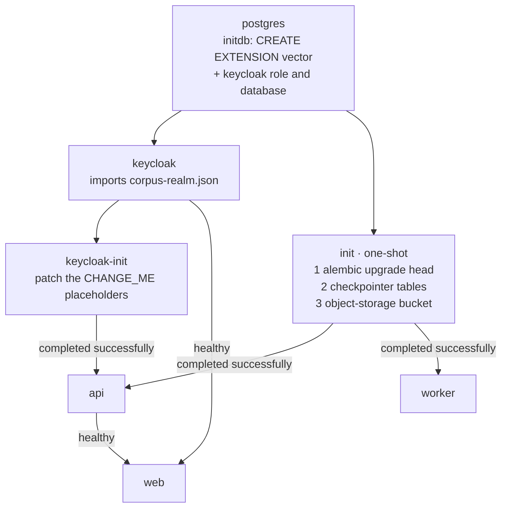

# Deployment

Running Corpus as a containerized stack: API, worker, SPA + edge, PostgreSQL, Redis, MinIO,
ClamAV and Keycloak, from one command.

> **This is the production stack.** For the *development* setup — the application running natively
> on your machine beside a few infrastructure containers — see
> [`deployment/README.md`](../deployment/README.md). The two are unrelated; the dev compose file
> is untouched by anything here.

---

## 1. Prerequisites

- Docker with Compose v2.
- **~6 GB of memory available to Docker.** Measured idle footprint of the full stack is **~2.5 GB**
  — ClamAV 947 MB (capped at 2 GB), Keycloak 731 MB (JVM), MinIO 254 MB, api 213 MB, worker 211 MB,
  PostgreSQL 78 MB, nginx 25 MB, Redis 5 MB — and the headroom is for ingestion and image builds.
  On Docker Desktop this is a setting, and **too little memory is the most common cause of a failed
  first bring-up**.
- ~5 GB of disk for images and volumes. The built images are **506 MB** (backend, shared by api,
  worker and the bootstrap) and **54 MB** (web).
- An OpenAI API key.

Measured cold start, from `down -v` to every healthcheck passing: **~60 seconds** once images are
built. The first build is longer.

## 2. Quick start

```bash
cp deployment/.env.prod.example deployment/.env.prod
# fill in every CHANGE_ME and OPENAI_API_KEY

docker compose -f deployment/docker-compose.prod.yml \
               --env-file deployment/.env.prod \
               up -d --wait --build
```

Then open **http://localhost:8088** and sign in as `admin@corpus.local` with the
`CORPUS_ADMIN_PASSWORD` you set.

`--wait` blocks until every healthcheck passes *and* both one-shot bootstrap services have exited
successfully. A cold run takes about a minute once images are built; the first build takes longer.

Check it:

```bash
curl -s localhost:8088/health                 # {"status":"ok"}
curl -s localhost:8088/health/ready           # database, broker, object storage
curl -s localhost:8088/health/ready/worker    # + arq heartbeat + clamav
```

Tear down with `down`, or `down -v` to discard the data volumes as well.

## 3. Configuration

`deployment/.env.prod` configures the **stack** — ports, credentials, which URLs things answer on.
The application's own settings keep their defaults; `backend/.env.example` documents every one of
them, and `backend/tests/test_env_templates.py` fails if it stops doing so. To override one, add
it to the `x-corpus-env` block in the compose file: only variables referenced there are passed
into a container.

Values that must change for any real deployment: every `CHANGE_ME`, `OPENAI_API_KEY`,
`PUBLIC_ORIGIN`, and the three Keycloak URLs in §6.

`ENVIRONMENT=production` is set for you by the compose file, and it is not cosmetic — see
[ARCHITECTURE.md](ARCHITECTURE.md) §6 for the six boot refusals, two of which key on that exact
string.

## 4. What happens on first boot



`init` is a **one-shot service**: `api` and `worker` wait for it to *complete*, not to be healthy.
Its three steps are all idempotent and all re-run on every deploy:

1. **`alembic upgrade head`** — the application schema.
2. **`python -m app.services.checkpointer`** — LangGraph's four `checkpoint*` tables, which
   Alembic does **not** own. Skip this and the first chat request raises
   `CheckpointerNotProvisionedError`. It is a separate step rather than lazy-on-first-use because
   `CREATE INDEX CONCURRENTLY` cannot run in a transaction and two API replicas would race.
3. **The object-storage bucket.** `STORAGE_AUTO_CREATE_BUCKET` creates it on first *use*, but the
   readiness probe's `HeadBucket` is not a use — so without this step a brand-new stack answers
   `503` from `/health/ready` until somebody happens to upload a document, and never becomes
   healthy.

The `initdb` scripts run **only on the first initialisation of an empty volume**. Adding them to a
populated database does nothing; create the Keycloak role and database by hand there.

## 5. Keycloak

The committed realm (`deployment/keycloak/corpus-realm.json`) ships four `CHANGE_ME_…`
placeholders, and **two are live credentials the moment it is imported**: the `corpus-backend`
client secret and the `admin@corpus.local` password. `keycloak-init` replaces them from your env
file by running `deployment/keycloak/patch-realm.sh`, which is idempotent:

```bash
docker compose -f deployment/docker-compose.prod.yml --env-file deployment/.env.prod \
  run --rm keycloak-init
```

The admin console is published on loopback only, at **http://localhost:8180/auth**, using
`KC_BOOTSTRAP_ADMIN_USERNAME` / `KC_BOOTSTRAP_ADMIN_PASSWORD` (the *master* realm — not the Corpus
administrator).

**Two hazards, neither discoverable from its error message:**

- **Never enable a required action**, and never set a temporary password. Login is ROPC, so there
  is no browser to satisfy one and the account is bricked permanently. Keycloak reports only
  "Account is not fully set up".
- **Re-importing the realm over a populated Corpus database strands the administrator.** The
  artifact declares no user id, so a re-import mints a fresh subject while Corpus's `users.email`
  is unique. `down -v` then up is clean; re-importing in place is not.

Realm mechanics, the identity-brokering setup for cloud import, and the two realm role grants it
needs are in [`deployment/keycloak/README.md`](../deployment/keycloak/README.md).

## 6. The three Keycloak URLs

**The most error-prone configuration in the stack**, so it gets its own section. Three values,
and they are not interchangeable.

| Value | Read by | Must be reachable from |
|---|---|---|
| `KC_HOSTNAME` | Keycloak itself | — (it is what Keycloak *advertises*) |
| `KEYCLOAK_SERVER_URL` | the API, to validate `iss`, and for the two browser redirects | the **browser** |
| `KEYCLOAK_INTERNAL_URL` | the API, for JWKS, tokens, logout, admin and broker calls | the **API container** |

**`KC_HOSTNAME` and `KEYCLOAK_SERVER_URL` must be identical, path included.** Keycloak builds the
`iss` claim from `KC_HOSTNAME` and **not** from the URL the request arrived on, so with
`KC_HTTP_RELATIVE_PATH=/auth` but a `KC_HOSTNAME` lacking that path it serves
`/auth/realms/corpus` while *advertising* `…/realms/corpus` — and the API then rejects every
token, reporting only an invalid issuer.

**`KEYCLOAK_INTERNAL_URL` exists because the browser and the API resolve different names for the
same Keycloak.** Leave it empty for a single-host deployment; set it whenever they differ. The
split is by *reader*, not by convenience — `iss` and the two FR-AUT-11 browser redirects stay
public, while JWKS, token, logout, admin and broker-token calls go internal.

The shipped default. Every surface works against it, **including the account-linking redirect
that FR-KBM-10 cloud import depends on** — that feature additionally needs Google OAuth
credentials in the realm (§5), without which it stays switched off:

```dotenv
PUBLIC_ORIGIN=http://localhost:8088
KC_HOSTNAME=http://localhost:8088/auth
KEYCLOAK_SERVER_URL=http://localhost:8088/auth
KEYCLOAK_INTERNAL_URL=http://keycloak:8080/auth
```

Keeping the public origin on **literal `localhost`** is deliberate: browsers treat it as a
trustworthy origin, so the `Secure` refresh cookie works over plain HTTP (§7).

A real deployment changes the public half and leaves the internal half alone:

```dotenv
PUBLIC_ORIGIN=https://corpus.example.com
KC_HOSTNAME=${PUBLIC_ORIGIN}/auth
KEYCLOAK_SERVER_URL=${PUBLIC_ORIGIN}/auth
KEYCLOAK_INTERNAL_URL=http://keycloak:8080/auth
```

That also avoids hairpinning every server-to-server call out through the edge and back — slower,
and commonly blocked by network policy.

**If you point `KEYCLOAK_INTERNAL_URL` at the public origin** (or unset it while the public origin
is not reachable from the containers), the API cannot fetch JWKS and every login fails with a
connection error. **If you point `KEYCLOAK_SERVER_URL` at the internal one**, tokens validate but
the account-linking redirect sends the browser to a host it cannot resolve.

## 7. TLS and the `Secure` cookie

Terminate TLS at the edge (or at a load balancer in front of it) and set `PUBLIC_ORIGIN`
accordingly. Internal hops stay plain HTTP on the private network.

In production the refresh cookie is `Secure` — the app refuses to boot otherwise. That interacts
with plain HTTP in a way worth knowing:

- **`http://localhost:8088` works.** Browsers treat the literal `localhost` / `127.0.0.1` as a
  trustworthy origin and accept `Secure` cookies from it. This is why the quick start works and
  why the end-to-end suite passes against it.
- **A hostname that merely resolves to loopback does not** — `corpus.local`,
  `host.docker.internal`. There the cookie is dropped and the session silently fails to survive a
  reload.

If you must run a non-localhost origin over plain HTTP for a local trial, set
`ENVIRONMENT=staging`. That string gates only the two production refusals, and
`CHECKPOINTER_BACKEND=postgres` is set explicitly anyway — so you are consciously stepping around
two guards, not silently weakening the rest. Do not do it in production.

## 8. Operations

**Logs.** `docker compose … logs -f api worker`. Structured JSON, with `conversation_id` and
`turn_index` bound to every event in a turn, plus an `X-Request-ID` echoed on every response.

**Scaling.** `api` and `worker` are stateless — `--scale api=3`. Ingestion throughput scales with
worker *processes*, not with `WORKER_MAX_JOBS`. **Do not scale `init`.**

**Backups.** `pgdata` (application *and* Keycloak databases) and `minio-data` (the original
uploads). Both are needed: the database alone cannot reconstruct a document's bytes.

**Upgrades.** Rebuild and `up -d`; `init` re-runs migrations and the checkpointer bootstrap
automatically. Roll back by redeploying the previous image — but note that a migration is not
reversed by doing so.

**Scheduled work.** The worker runs three crons: an undispatched-job sweep, checkpoint pruning,
and telemetry retention (90 days). Retention policies are in
[DATA_MODEL.md](DATA_MODEL.md) §6, including the two `0` values that mean opposite things.

**Cost.** Every chat turn makes router, rerank and generation calls, and every answered turn is
judged in the worker. `LLM_BACKEND=fake` and `EMBEDDING_BACKEND=fake` give a zero-spend smoke test.

**Changing a model without a restart.** Each call site has its own model id, and each can be
repointed at runtime — the value is read per turn, so both the API and the worker pick it up with
no redeploy:

```bash
docker compose … exec api python -m tools.set_model                    # what is in force
docker compose … exec api python -m tools.set_model set router gpt-4o-mini
docker compose … exec api python -m tools.set_model clear router       # back to the env default
```

Slots are `chat`, `router`, `rerank`, `judge` and `judge_escalation`. An unset slot uses its
`OPENAI_*` environment value, so a deployment that never runs this behaves exactly as configured;
`clear` is the only way back to the default, which is why setting a slot to the default id is not
the same thing.

`set` asks the provider whether it serves the id before storing it, and refuses if not. That check
matters most for `chat`: generation is the one stage that fails **closed**, so a typo there would
make every subsequent turn return an error, where a bad `router`, `rerank` or `judge` id only
degrades that stage. `--no-verify` skips the check for hosts that cannot reach the provider.

**Embeddings is deliberately not a slot.** `OPENAI_EMBEDDING_MODEL` is folded into each chunk's
embedding fingerprint, so changing it live would leave existing chunks holding vectors from the old
model while new ingests write the new one — and both get compared in the same similarity query,
with nothing failing anywhere. It stays a restart-and-re-embed operation, and the re-embed half is
the next section.

**Re-embedding after a pipeline change.** Three settings are folded into every chunk's fingerprint:
`OPENAI_EMBEDDING_MODEL`, the four `CHUNKER_*` sizing knobs (as one composite version) and the
parsers' preprocessing version. Change any of them and *new* ingests use the new pipeline while
every document already indexed keeps serving vectors from the old one. Nothing detects that on its
own, and no ordinary route will re-drive a healthy document — that is deliberate, because re-embedding
a corpus costs real money.

Start by looking. This is read-only and safe at any time:

```bash
docker compose … exec api python -m tools.reembed
```

It prints the pipeline in force, how many `ACTIVE` documents were built by a different one, which of
the three inputs drifted for each, and **an estimate of the embedding tokens a full run would spend**.
Then re-drive a bounded batch:

```bash
docker compose … exec api python -m tools.reembed run --limit 50
```

`--limit` is required; there is no "all of them". The command only *queues* the work — the worker
does it — so re-run the plan once the queue has drained and repeat until it reports nothing. That
loop is safe to interrupt and safe to repeat: a rebuilt document drops out of the stale set, and one
still being rebuilt is excluded from the next batch rather than queued twice.

Same two operations over HTTP, for an administrator token:

```
GET  /api/v1/admin/documents/stale?limit=50[&owner_id=…]
POST /api/v1/admin/documents/{document_id}/reembed
```

What to expect while it runs:

- **Documents keep answering questions throughout.** A rebuild writes a *new* version and the
  previously indexed one keeps serving until the new one is complete, so retrieval never sees a
  half-built document and never mixes two models in one query.
- **Storage briefly doubles for the documents in the batch.** Each rebuild copies the stored
  original forward and the superseded copy is deleted after the new version lands. Users' storage
  allowances are unaffected.
- **A rebuild that fails leaves the document showing `Failed` while the previous version continues
  to answer.** The knowledge-base row says so (`update failed, v{n} still answering`), and the job's
  own diagnostics are at `GET /api/v1/jobs/{id}`.
- Two refusals are normal and not errors: `NOT_STALE` means that document is already current
  (harmless — re-run the plan), and `NOT_REBUILDABLE` means it is mid-ingestion or being deleted.
  `ORIGINAL_CORRUPT` is the one that needs a person: the stored file no longer matches its recorded
  checksum, and it must be re-uploaded.

Prefer off-peak. Each rebuild ends with a version swap, and a swap landing in the middle of a chat
turn can cost that one turn its citations — the same window a document replacement already opens.

## 9. Verifying a deployment

Beyond the three probes, the end-to-end suite drives a real browser through the whole journey —
sign in, upload, ingest, ask, cite, rate, regenerate, rename, delete — against a running stack:

```bash
cd frontend
E2E_BASE_URL=http://localhost:8088 CORPUS_PASSWORD='…' npm run e2e
```

It takes about 20 seconds, makes real model calls, and is the only check that exercises the edge,
the SSE streaming path, the multipart upload path and the session cookie together. See
[`frontend/e2e/README.md`](../frontend/e2e/README.md).

## 10. Troubleshooting

| Symptom | Cause | Fix |
|---|---|---|
| `postgres` restart-loops complaining about `/var/lib/postgresql/data` | PostgreSQL 18+ wants the volume at `/var/lib/postgresql` | already correct in the prod compose; check any customisation |
| `/health/ready` → 503, `object_storage: 404 HeadBucket` | bucket never created | re-run the `init` service |
| First chat request → `CheckpointerNotProvisionedError` | checkpointer bootstrap skipped | `docker compose … run --rm init` |
| Upload stays at `Queued` forever | worker not running, or gated on an unhealthy clamav | `logs worker`; check `/health/ready/worker` |
| `clamav` unhealthy, restart-looping | the image's stock probe pings `localhost`→`::1` while clamd binds `0.0.0.0` | the prod compose overrides it with `clamdscan --ping 1`; do not revert to the default |
| Login fails with an invalid-issuer error | `KC_HOSTNAME` and `KEYCLOAK_SERVER_URL` disagree | §6 — they must match exactly, `/auth` included |
| Login fails with a connection error to Keycloak | `KEYCLOAK_INTERNAL_URL` unset or pointing at an origin the containers cannot reach | §6 — set it to the service name |
| Account linking lands on an unreachable page | `KEYCLOAK_SERVER_URL` points at the internal host | §6 — the public half must be browser-resolvable |
| Login → 400 "Account is not fully set up" | a Keycloak required action is set | clear it; never set a temporary password (§5) |
| Session lost on every page reload | `Secure` cookie dropped at a non-localhost plain-HTTP origin | terminate TLS (§7) |
| Answers arrive all at once instead of streaming; document list stops updating | proxy buffering re-enabled | `deployment/nginx/streaming.inc` must stay included by the `/api/` location |
| `413` on a large upload | `client_max_body_size` below the 50 MB limit | it is 64m in the shipped config |
| Everything times out on first `--wait` | Docker memory | give Docker ~6 GB (§1) |

## 11. Design decisions and rejected alternatives

| Decision | Rejected | Why |
|---|---|---|
| A separate `docker-compose.prod.yml` | a `prod` profile in the dev compose file | The dev file publishes ports and carries dev credentials by design; a profile inside it inherits both. The two files have opposite defaults, not different service lists. |
| One backend image, three commands | separate api / worker / migration images | One dependency resolution and one build. Three images is three chances for the halves to drift on a library version. |
| A one-shot `init` service | an entrypoint hook on api and worker | An entrypoint races itself across replicas on `CREATE INDEX CONCURRENTLY`, and `--wait` never observes "completed" on a service with a restart policy. |
| nginx serves the SPA and proxies | FastAPI `StaticFiles` mounting the bundle | Keeps production Python unchanged, and puts static serving, compression and caching where they belong. Also makes the same-origin property explicit rather than incidental. |
| Keycloak inside the stack | assume an external identity provider | One `up -d` has to actually produce a working product, otherwise the documentation is a wish. A real deployment overrides the URLs and drops the service. |
| Keycloak shares the PostgreSQL server, separate database | a second PostgreSQL service | One backup surface, one tuning surface, and the schemas never join. Split it if a version conflict ever forces the issue — a five-line change, noted in the compose file. |
| `start --import-realm` | `start --optimized` | `--optimized` needs an image pre-augmented with `kc.sh build`, i.e. a third Dockerfile, to save a one-off ~20–30 s first boot. |
| Only the edge publishes a port | publish PostgreSQL, Redis, MinIO too | Correct hardening, and it is also what lets the production stack run beside a developer's existing containers without fighting for 5432/6379/9000. |
| `clamdscan --ping 1` healthcheck | the image's stock `clamdcheck.sh` | The stock probe pings `localhost`→`::1` while clamd binds `0.0.0.0`, so it reports unhealthy while clamd is fine — and `restart` plus `depends_on` would then restart-loop a working scanner forever. |
| Only the worker gates on ClamAV | api waits for it too | A dead scanner must stop ingestion, not pull the chat surface out of the load balancer. The readiness arms are split for exactly this. |
| The bootstrap creates the bucket | rely on `STORAGE_AUTO_CREATE_BUCKET` | Auto-create fires on first *use*, and `HeadBucket` is not a use — so a fresh stack answered `503` forever and never became healthy. Found by running it. |
| Compose for the reference deployment | Kubernetes manifests / Helm chart | Compose is what a reader can run in one command to evaluate the system. Orchestrator manifests are a deployment-target choice, and are deliberately left out (§12). |

## 12. What this deployment is and is not

Honest scope, so nobody mistakes the reference stack for a production topology.

**It is** a complete, self-contained, verified deployment: every dependency, the migrations and
bootstrap, a realm with its placeholders replaced, and an end-to-end journey passing against it.

**It is not:**

1. **Multi-node or highly available.** Single Docker host, one instance of each stateful service.
   PostgreSQL has no replica, Redis has no sentinel, MinIO is single-drive.
2. **TLS-terminating.** The stack speaks plain HTTP and expects TLS at your edge. There is no
   certificate automation here.
3. **Orchestrator-ready.** No Kubernetes manifests, no Helm chart. The images are ordinary and
   would port straightforwardly; nobody has done it.
4. **Backed up.** `pgdata` and `minio-data` are named volumes with no backup job. §8 says what to
   copy; nothing copies it for you.
5. **Secret-managed.** Configuration is environment variables from a file on disk. Rotation is a
   redeploy, and there is no integration with a managed secret store.
6. **Zero-downtime on upgrade.** `up -d` recreates containers; the bootstrap runs migrations
   forward, and rolling back after a data-shape change is a restore, not a `downgrade`.
7. **Autoscaling.** Replica counts are manual (`--scale`), and `init` must never be scaled.
8. **Continuously integrated.** No pipeline builds these images or runs the suites on a change.
9. **Cost-metered.** Every chat turn makes model calls and every answered turn is judged; nothing
   here caps spend beyond the application's own rate limits.

For a production rollout the shortest sensible path is: put the images behind your own
orchestrator, replace PostgreSQL/Redis/object storage with managed equivalents, point
`KEYCLOAK_SERVER_URL` and `KEYCLOAK_INTERNAL_URL` at your identity provider, terminate TLS at the
edge, and keep the `init` step as a pre-deploy job.
