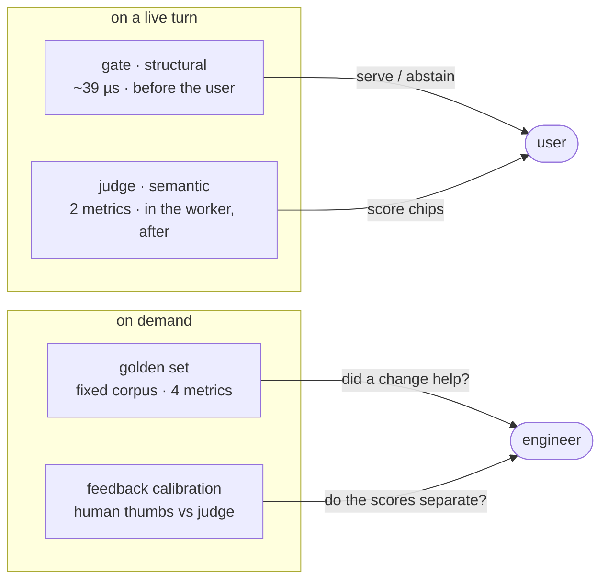

# Evaluation

How Corpus measures whether its answers are any good, what each instrument can and cannot tell
you, and how to run them.

The short version: **three instruments, three different jobs, and none of them is an oracle.**
Most of what follows is a report of measurements, not a description of intent — where a threshold
or a model tier is set the way it is, it is because running it the other way was tried.

---

## 1. The three instruments



| Instrument | Runs | Scope | Reaches a user? |
|---|---|---|---|
| **Groundedness gate** | in the turn, before the answer is served | this answer | yes — decides serve vs abstain |
| **Per-message judge** | in the worker, after the answer was served | this answer | yes — the score chips |
| **Offline golden set** | on demand, `python -m evals.run` | a fixed authored corpus | never |
| **Feedback calibration** | on demand, `python -m tools.feedback_calibration` | accumulated 👍/👎 | never |

They answer different questions. The chips say *how did this answer score*; the golden set says
*did a change to retrieval make the system better*; the calibration report asks *do our automated
scores agree with humans at all?*

## 2. Why two metrics on a live turn, and not four

The evaluation library offers four RAG metrics. **Only two can run on a live chat turn**, and
discovering that changed what shipped:

| Metric | Live turn | Why |
|---|---|---|
| Answer Relevancy | ✅ | reference-free |
| Faithfulness | ✅ | reference-free |
| Contextual Precision | ❌ | requires `expected_output` |
| Contextual Recall | ❌ | requires `expected_output` |

A chat turn has no reference answer, and nothing in the product supplies one. Two workarounds were
considered and both rejected:

- **Synthesise the reference from the answer being scored.** Self-referential, and high by
  construction — it would launder a proxy as a measurement.
- **Relabel a reference-free metric with a reference-based name.** Rejected on a sharper ground
  than tidiness: other approximations in this system are invisible to users, whereas a mislabelled
  **chip** is a false claim rendered next to an answer.

So the reference-based pair moved to the offline harness (§5), where a reference genuinely exists,
and the requirement's rendering rules were amended to show whichever metrics are present rather
than a fixed four.

**Faithfulness scores the passages the answer actually cited**, not the whole retrieved set — which
is what makes it measure the property the product promises.

**Evaluation fails open.** If the judge is unreachable or slow, the message keeps a `NULL`
evaluation and the UI shows no chips. That is a sanctioned degraded state, and it is why
`EVAL_ENABLED` legitimately exists where `GATE_ENABLED` deliberately does not: the gate's "off"
state would remove a guarantee, the judge's merely removes a decoration.

## 3. The gate is not the judge

Two things measure groundedness, and they can disagree in front of one user. That is intended, and
worth understanding before you try to "fix" it.

| | Groundedness gate | Faithfulness score |
|---|---|---|
| When | **before** the answer is served | after |
| Cost | **~39 µs**, no I/O, no model call | ~5 judge calls, seconds |
| Asks | *did the model cite?* (structural) | *do the sources support the text?* (semantic) |
| Effect | serve / abstain | a chip |
| Fails | closed | open |

The gate is a **safety control**, so it is cheap, deterministic, and cannot fail on a provider
blip. The judge is a **quality signal**, so it is semantic and allowed to be slow and occasionally
wrong.

**A pre-serve semantic judge was considered and rejected on four compounding grounds**, and the
first is decisive: it would duplicate the post-hoc judge from the same vendor and then contradict
it inside a single message bubble. It would also add ~1.5 s of *unhideable* latency (the judge
*is* the thing gating the stream), have to fail closed at the very last node after all upstream
cost is sunk, and inherit the "a passage can argue for its own relevance" problem at a
serve/don't-serve call site rather than a ranking one.

**The gate's limitation is stated, not hidden:** it measures *that the model cited*, not *that the
passage supports the claim*. A fabricated answer citing a real, in-scope passage passes the gate at
1.00 and scores **0.0** on faithfulness — reproduced deliberately on the first attempt, and exactly
the case the post-hoc judge exists to catch. Their disagreement is preserved as internal signal
rather than reconciled away.

### The coverage rule came from measurement

The first implementation scored coverage per sentence. Against real answers it scored genuinely
grounded output at **0.25–0.5**, and would have abstained on **2 of 12 correct answers** — because
a real model writes two or three sentences from one passage and cites once at the end of the
paragraph. Rescoped to **blocks**, the same corpus scored **12/12 at 1.00**, with both unanswerable
questions at **0.00**.

Hence the standing rule: **if healthy answers cluster below `GATE_MIN_GROUNDEDNESS` (0.5), the
metric is wrong, not the threshold.**

## 4. Judge selection and escalation

| Setting | Value | Why |
|---|---|---|
| `OPENAI_JUDGE_MODEL` | `gpt-4o` | chosen by measurement, below |
| `EVAL_ESCALATE_BELOW` | `0.9` | re-judge low chips with a stronger model; `0.0` disables |
| `OPENAI_JUDGE_ESCALATION_MODEL` | `gpt-4o` | equal to the base tier, so escalation is **dormant** by default |

**The cheap judge's errors were systematic, not noisy, and that is what ruled out the obvious fix.**
`gpt-4o-mini` scored a *verbatim-grounded* answer **0.33–0.67** against its real eight-passage
grounding set (0.00 once), and **1.00** when given only the answering passage — so **the error
scales with grounding-set size**. Median-of-N sampling was therefore rejected: the median was 0.50,
still wrong. Only a stronger judge fixed it.

Escalation re-judges a chip below the threshold; the second score **replaces** the first rather than
taking a maximum, and the mechanism **fails open** to the first score. Provenance is telemetry, not
payload — it never reaches `messages.evaluation`.

**Escalation is switched off inside the offline harness on purpose.** Selectively re-judging the
scores you dislike is a biased estimator: acceptable for a chip a user reads, disqualifying for the
instrument you use to decide whether a change helped. That is enforced at the call site by a test.

## 5. The offline golden set

An authored corpus with known-correct answers, so a retrieval or prompting change can be measured
rather than guessed at.

```bash
cd backend
uv run python -m evals.run                 # whole corpus
uv run python -m evals.run --limit 10      # a slice
uv run python -m evals.run --band answerable
uv run python -m evals.run --out results/run.json
```

**Measured at adoption over 30 items:** retrieval **recall@k 1.00**, context precision **1.00**, and
**zero fabrications across twelve non-answerable questions** — the abstain path holding under a
corpus built to tempt it.

Reading the output:

- **The deterministic metrics are the control.** Recall@k is computed, not judged. If it moves,
  retrieval changed; if only judge numbers move, be suspicious of the judge.
- **The reference-based pair runs on the *answerable* band only.** Contextual Recall against "the
  documents do not say" measures its own vacuity.
- **The corpus is authored, not sampled** — a recorded deviation. It exercises retrieval and
  generation, not the parser or the chunker.
- **A known cost, quantified:** 8 of 12 honest declines are replaced by generic abstain copy, so the
  harness under-reports how *specific* a good refusal was.

## 6. Feedback calibration

The thumb on an answer is the **only human judgement in the system** — every other score here is a
model assessing a model.

```bash
cd backend
uv run python -m tools.feedback_calibration                 # last 90 days
uv run python -m tools.feedback_calibration --days 30
uv run python -m tools.feedback_calibration --owner <uuid>
uv run python -m tools.feedback_calibration --json
```

The report leads with **separation**: do the automated scores tell apart what users told apart? If a
metric shows no positive gap between thumbs-up and thumbs-down answers, its threshold table is
**omitted** rather than printed to be read sceptically — tuning a knob on a score carrying no signal
is the most expensive way to make a product worse while looking rigorous.

Three design details that are easy to get wrong:

- **The sample floor is checked *before* the tables are built**, not warned about above them. A
  caveat over a table loses to a number inside it.
- **The join to telemetry is an outer join.** An inner join would report zero on precisely the
  deployment whose value is the feedback accumulated *before* telemetry existed — and silently.
- **`--owner` exists** because under per-user scoping one heavy rater would otherwise calibrate
  everyone's thresholds invisibly.

It always exits `0`, so nobody wires "not enough feedback yet" into CI as a failure.

**Feedback is a measurement, not a controller.** There is deliberately no loop that tunes thresholds
from accumulated thumbs, on four grounds — the last sufficient alone:

1. a thumb is **one bit over a confounded event** (wrong answer, missed retrieval, verbose model,
   disliked document, mis-click), so it does not isolate the subsystem a knob belongs to;
2. its **direction is ambiguous** — a 👎 on a *served* answer argues for a stricter gate, on an
   *abstention* for a looser one;
3. the loop would be a **biased estimator of its own effect** (§4's argument again);
4. **these are safety controls before they are tuning knobs.** A loop moving
   `GATE_MIN_GROUNDEDNESS` from an aggregate of thumbs would let users **switch off grounding by
   disliking answers.**

## 7. Reading the numbers

**Two decimals are indicative, not exact — and this is measured, not modesty.** Two frontier judges
disagree by **≥0.25 on 22% of chip scores**, and *both* score verbatim restatements of the cited
passage at **0.50**. The digits are genuine model output; they are not a measurement. Read `0.94`
as "high", not as distinct from `0.97`. The UI carries that caveat in the metric tooltip, as one
shared constant rather than two copies that can drift.

**Rerank scores are quantised by the model, not by the scale.** The obvious improvement — raise
`RERANK_SCORE_SCALE` from 10 to 100 to earn a second decimal — was measured across 90 scored
passages on two models: **not one value had a non-zero second decimal**, and at scale 100 both
models returned **only multiples of ten**. The resolution was never the scale's to grant; it belongs
to the model, which reasons in tenths whatever range it is handed. Raising it would have advertised
precision the judge lacks.

**A missing score is not a bad score.** Reranking fails open and publishes none; an unscored metric
renders its track and no fill, never a zero. A zero-width red bar would be a claim about a metric
nobody measured.

**An average is not a score.** Band colour and bar width derive from the *rounded* value, because
`0.8951` renders as `0.90` while banding the raw value paints it amber — a hue disagreeing with the
numeral beside it.

## 8. Cost and latency

| | |
|---|---|
| Judge calls per evaluated message | **5** |
| Median wall-clock per message | **~5.9 s** |
| Where it runs | the worker, **after** the answer is served |
| On the user's clock | **never** |
| Escalation rate at threshold 0.9 | ~28% of messages, when a second tier is configured |

Every judge call is routed through the same model client seam as the rest of the system. That was
verified before the dependency was adopted — 5 calls per message, **zero outbound HTTP** outside the
seam — which is what keeps a deterministic fake backend honest for the whole test suite, applies the
project's own timeout and retry budget, and means vendor telemetry can be opted out at import *and*
per measurement.

Set `LLM_BACKEND=fake` and `EMBEDDING_BACKEND=fake` for a run that spends nothing.

## 9. Design decisions and rejected alternatives

Collected, because most of this document is the *result* of turning something down.

| Decision | Rejected | Why |
|---|---|---|
| Ship two live metrics | synthesise `expected_output` from the answer | Self-referential and high by construction — it would launder a proxy as a measurement. |
| Ship two live metrics | relabel a reference-free metric with a reference-based name | Other approximations here are invisible to users; a mislabelled **chip** is a false claim rendered beside an answer. |
| Structural gate before serving | a second, semantic judge pre-serve | Duplicates the post-hoc judge from one vendor and contradicts it in one bubble; ~1.5 s of *unhideable* latency; must fail closed at the last node after all cost is sunk. |
| A stronger judge model | median-of-N sampling on the cheap one | The cheap judge's errors are **systematic, not noisy** — median was 0.50, still wrong. Measured before deciding. |
| Escalated score **replaces** the first | `max()` of the two | A maximum is optimism, not measurement. |
| Escalation **off** in the offline harness | escalate there too | Selectively re-judging low scores is a biased estimator: fine for a chip, disqualifying for the instrument that decides whether a change helped. |
| Report feedback, never act on it | an automatic threshold-tuning loop | Four grounds in §6, the last sufficient alone: these are safety controls, so a loop lets users switch off grounding by disliking answers. |
| Omit a threshold table with no separation | print it with a caveat | A caveat above a table loses to a number inside it. Tuning on a signal-free score is the expensive way to get worse. |
| Keep `RERANK_SCORE_SCALE` at 10 | raise it to 100 for a second decimal | Measured over 90 passages on two models: **not one non-zero second decimal**, only multiples of ten. The resolution belongs to the model, not the scale. |
| Keep two decimals on chips | show the band only | The numeral is the non-colour carrier that the accessibility exceptions depend on, and `0.9` is no more *trustworthy* than `0.94` — the defect is confidence, not digits. Fixed by saying so in the tooltip. |
| Block-scoped coverage | per-sentence coverage | Per-sentence scored grounded answers 0.25–0.5 and would have abstained on 2 of 12 correct ones. |
| Judge through the existing model seam | the vendor's own client | Keeps a deterministic fake backend honest for ~1,800 tests, applies our timeout/retry budget, and makes vendor telemetry opt-out reachable. |

## 10. Known limitations

1. **Two of four metrics are unavailable live** (§2), and no amount of engineering changes that
   without a reference answer the product does not have.
2. **The gate is structural** (§3) — mitigated by post-hoc judging, not solved.
3. **Judge scores carry no confidence interval.** 22% inter-judge disagreement is reported here, not
   surfaced per score.
4. **The golden set is authored and small**, so it measures regression, not absolute quality, and
   never touches parsing or chunking.
5. **No automated regression gate.** Nothing fails a build when a score drops; with no CI, running
   the harness is a human act.
6. **Evaluation is per message, never per conversation.** Multi-turn coherence is unmeasured.
7. **Feedback coverage is typically low** — on the development corpus the report correctly refused
   to conclude at 4 ratings and 40% coverage. That refusal is the feature, but it means calibration
   needs real traffic before it says anything.
8. **The judge and the generator share a vendor.** Correlated blind spots are possible and are not
   currently controlled for.
