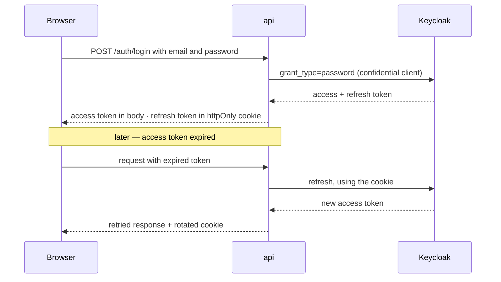

# Security

What Corpus defends, how, and — as importantly — what it does not defend and where the limits are.
Deployment mechanics are in [DEPLOYMENT.md](DEPLOYMENT.md); realm setup is in
[`deployment/keycloak/README.md`](../deployment/keycloak/README.md), which this document
deliberately does not restate.

Two framing notes. First, several controls here are **structural** — they hold because of how the
code is shaped rather than because a check runs, and those are called out, since they are the ones
that survive a refactor by someone who has not read this page. Second, every limitation in §11 is
real and none of them is phrased away.

---

## 1. Trust boundaries

| Boundary | Treatment |
|---|---|
| Browser → edge | Untrusted. TLS terminates here. |
| Edge → api | Trusted network hop; the edge forwards `X-Forwarded-*`. |
| Uploaded file bytes | **Untrusted, always** — sniffed, size-capped, scanned, parsed under decompression limits. |
| Retrieved document text | **Untrusted input to the model** — fenced and neutralised, never in the system message. |
| Model output | Untrusted — citation markers are resolved against a supplied list, never followed. |
| Keycloak | The authority for identity. Corpus mirrors users; it does not own credentials. |
| Google Drive (optional) | Untrusted third party; its token never reaches Corpus's database. |

## 2. Threat model

The threats that actually shaped the design, and what carries each one.

| Threat | Primary control | Residual risk |
|---|---|---|
| Credential theft / replay | Keycloak-owned credentials; RS256 validated per request; refresh token in an httpOnly cookie only | Access token valid until expiry if exfiltrated from memory |
| Cross-user data access | Ownership as a **query predicate**, evaluated per request from live context | None known; covered by a generated route matrix |
| Enumeration of other users' resources | `404` (never `403`) for foreign ids, administrators included | — |
| Prompt injection via a **query** | Two-tier pattern screen, fails closed | Evadable by construction — §5 |
| Prompt injection via **document text** | Structural prompt isolation; text is never blocked | A prior assistant answer re-enters as trusted speech (§11) |
| Model exfiltrating data it should not see | Retrieval scope is SQL, not prompt text; **no tools are exposed** | — |
| Malicious upload | Magic-byte typing, ClamAV INSTREAM, structural checks, decompression caps | Zero-day malware; scanner is defence-in-depth, not the only layer |
| Resource exhaustion | Per-file and per-user quotas, rate limits, SSE stream caps, worker timeouts | Quota is best-effort under concurrency |
| Stolen third-party (Drive) token | Corpus never stores one — Keycloak brokers it | Compromise of Keycloak |
| Insider / operator error | Audit log; telemetry with no FKs so it cannot be cascade-deleted | Audit retention is unset (§11) |

**Explicitly out of scope:** multi-tenant isolation (§11), DDoS absorption at the edge, and
protection against a compromised OpenAI account.

## 3. Authentication

Keycloak (OIDC) is the identity provider. Login is **backend-mediated ROPC**: the browser posts
credentials to Corpus, Corpus exchanges them at Keycloak's token endpoint, and validates the
returned RS256 JWT against the realm JWKS — checking signature, issuer, expiry, **and both `aud`
and `azp`**. There is no local password hashing anywhere in the codebase.

**The refresh token has exactly one channel.** It is not in the response body — a cookie set beside
a body copy protects nothing. Scoped to `Path=/api/v1/auth`, `SameSite=strict`, `Secure` (refused
at boot in production if not).

**Renewal is request-driven, never on a timer.** A timer keeps the SSO session alive through any
amount of idleness, which silently deletes the realm's inactivity timeout — the control was
configured and then defeated by the client.

**A subtlety that reads as a bug and is not:** "any 401 returns the user to login" is wrong taken
literally, because `change-password` answers 401 for a wrong *current* password. The routes exempt
from session-ending are deliberately **not** the same list as the routes that skip renewal;
collapsing the two lets a stale token produce a 401 that the exemption then swallows.

**The ROPC constraint — the sharpest operational trap in the system.** There is no browser in the
login flow, so *any* Keycloak required action (`UPDATE_PASSWORD`, `VERIFY_PROFILE`, `VERIFY_EMAIL`)
is unsatisfiable and locks the account out **permanently**, reporting only "Account is not fully
set up". Never enable one as a realm default; never set a temporary password.

## 4. Authorization

Two roles, `admin` and `user`. Every data-bearing route resolves ownership **in the query**, from
the live request context, on every request — never from a checkpoint and never from anything beyond
identity in the token.

Three rules that are easy to get wrong, each pinned by tests:

- **Foreign resources answer `404`, not `403`** — including for an administrator. Distinguishing
  "does not exist" from "is not yours" turns any id-addressed route into an existence oracle. For
  conversations there is a second reason: the graph's `finalize` would otherwise write a turn into
  another user's durable transcript.
- **Revocation has two clocks.** `is_active` is read from the database every request, so disabling
  an account takes effect immediately. The **role is a token claim**, and `users` has no role column
  — so a demoted administrator keeps the role until the token expires (~5 minutes, measured against
  a real realm). **To remove access now, disable the account; demoting alone leaves a window.**
- **A route may not declare a status it cannot return.** Checked mechanically against the live
  application, after two routes were found declaring a `403` they actually answer as `409`.

## 5. Prompt injection

Screening is **query-only**, and that is a decision rather than an omission. Retrieved document
text is never blocked: the chunk is already inside the caller's own retrieval scope, and refusing it
would **permanently brick a document the user owns** — one uploaded security policy containing
"ignore previous instructions" would make every query that retrieves it unanswerable, and
undiagnosably so, since the user cannot see which chunk was retrieved.

The query screen is in-tree deterministic pattern rules in two tiers — `INSTRUCTION_OVERRIDE`,
`SYSTEM_PROMPT_EXFIL`, `ROLE_SPOOF`, `CHAT_CONTROL_TOKEN`, `PERSONA_OVERRIDE`, `AUTHZ_OVERRIDE`,
`FENCE_SPOOF` block; weaker markers only mark a query *suspicious*, which proceeds and is recorded.
No model call: a classifier adds a serial round trip before an already-delayed first token, and is
itself injectable.

**It is evadable, and that is recorded rather than papered over — which is precisely why the real
control is structural:**

- exactly **one** `system` message, containing instructions and **no untrusted bytes**;
- retrieved context fenced in a non-system role, with delimiters and forged `[S<n>]` markers
  neutralised in **every** untrusted string — *including the filename and locator*, which read like
  metadata but are attacker-chosen;
- the user's query last, in its own message.

That shape is what makes the requirement's three "must not alter" clauses hold **by construction**:
**no tools are exposed to the model**, authorization is evaluated in SQL from a non-checkpointed
context, and a citation the model invents but was not supplied is dropped rather than resolved.

A blocked turn answers with dedicated copy and **no error code**, naming no rule and echoing no
query — disclosure would turn each attempt into a probe. The screen fails closed.
`GRAPH_SCREEN_ENABLED` exists **only** because the structural controls have no switch and must
never acquire one.

## 6. Content controls

Applied in this order, before anything expensive happens:

1. **Type by magic bytes, never the extension.** CSV and Markdown have none, so they go through a
   binary/markup deny-list plus whole-payload UTF-8 and control-byte validation; any contradiction
   between sniffed family and extension is a `415`.
2. **Size before storage.** 50 MB per file, 10 GB per user, enforced *during* the read rather than
   from a `Content-Length` header a client controls.
3. **Malware screening at the head of the worker**, before parsing: ClamAV over `INSTREAM`, plus
   structural checks (a `.docx` containing `vbaProject.bin`; PDF `/JavaScript`, `/OpenAction`,
   `/EmbeddedFile`). A detection fails the document and purges it.
4. **Decompression caps in the parsers** — expanded bytes, compression ratio, member count, page and
   row ceilings. Caps **reject**; nothing is ever silently truncated.

Two properties worth stating plainly:

- **The scanner fails closed.** An unreachable clamd fails the ingestion job, retryably — the
  deliberate opposite of the rate limiter, which fails open.
- **`SCANNER_BACKEND=structural` is not an off switch.** It disables the ClamAV signature pass only;
  structural checks always run. There is no setting that disables screening entirely.

`CLAMAV_MAX_STREAM_BYTES` must be ≥ `UPLOAD_MAX_FILE_BYTES` **or the app refuses to boot**: clamd's
25 MB default `StreamMaxLength` **fails open** by truncating and reporting the clean prefix, and no
INSTREAM response reveals the daemon's limit. Keep it in step with `deployment/clamav/clamd.conf`,
which nothing in the application can validate.

## 7. Rate limiting

Backed by Redis so limits are shared across replicas. Login and refresh are keyed **per IP**; the
rest per principal. It **fails open** — a limiter that takes the product down when its store blips
is worse than the abuse it prevents.

Two operational notes, both found by testing rather than review:

- **`--proxy-headers` is load-bearing.** The per-IP key comes from the peer address; behind the edge
  without it, every user in the world shares one login bucket.
- **Bucket scope must be explicit for id-addressed routes.** The default key includes the concrete
  path, so a limit on `/documents/{id}/replace` gave a caller with *N* documents *N* × the intended
  allowance. Fixed with an explicit shared scope, verified against real Redis.

## 8. Secrets

| Secret | Lives | Never |
|---|---|---|
| Keycloak client secret | env → container | in the committed realm JSON |
| Corpus administrator password | Keycloak | in the repo |
| OpenAI API key | container env | in an image layer |
| Google OAuth client id/secret | **Keycloak only** | in Corpus's database or `.env` |
| Refresh token | httpOnly cookie | response body, `localStorage` |

The committed realm artifact ships `CHANGE_ME_…` placeholders, and **two are live credentials once
imported** — the client secret and the administrator password. The stack's bootstrap replaces them,
and a deployment that skips that step is a deployment whose administrator password is published on
GitHub.

`.gitignore` carries a backstop for `client_secret_*.json`: the cloud console hands you a file
containing a live secret, and it has no business in the tree at all.

## 9. Design decisions and rejected alternatives

| Decision | Rejected | Why |
|---|---|---|
| Keycloak owns identity | in-house password hashing (Argon2 + PyJWT) | Credentials, lockout, password policy and admin UI are solved problems with real failure modes; owning them adds risk and no product value. |
| Backend-mediated ROPC | browser authorization-code flow | Preserves the spec-authored login UI and keeps tokens off the browser's URL. **Accepted cost: the required-action lockout in §3**, and a second `standardFlow` client exists solely for account linking. |
| Refresh token in a cookie only | token in the response body / `localStorage` | `localStorage` is readable by any XSS; a body copy beside a cookie protects nothing. |
| `404` for foreign resources | `403` | `403` confirms existence, turning every id route into an oracle. |
| Screen the query only | screen retrieved chunks too | Blocking a chunk permanently disables a document the user owns, undiagnosably. §11 keeps the residual. |
| Deterministic pattern rules | an LLM classifier | A serial round trip before an already-slow first token, and the classifier is itself injectable. |
| Structural prompt isolation as the primary control | rely on detection | Detection is evadable; the fence, the single system message and the no-tools property are not. |
| Scan in the worker | scan synchronously at upload | A ~2 GB scanner on the request path; and R-31's placement keeps parsing isolated from the API process. |
| Rate limiter fails open | fail closed | An availability control that causes outages is a self-own. |
| No download/preview endpoint | serve files back | Corpus never re-serves an uploaded byte, which is what keeps signature scanning defence-in-depth rather than the last line. |
| Two roles | four-tier role model | The one capability it added — delegated account creation — already exists in Keycloak, where user management lives; duplicating it in app code creates two things to keep in sync. |
| No CORS middleware | permissive CORS for a separate SPA origin | Single origin is what makes `SameSite=strict` viable; relaxing it changes the session model, not just a header. |

## 10. How this is verified

`backend/tests/security/` — **282 tests** — is a committed **route manifest** rather than a set of
spot checks: every route declares who may call it, and the cells are generated from that
declaration.

| File | Covers |
|---|---|
| `test_authz_matrix.py` | authentication gate, ownership and status for every route |
| `test_permission_loss.py` | role loss and account disablement mid-session |
| `test_injection.py` | structure of the defence, plus a committed evasion corpus |
| `test_rate_limits.py` | bucket keys and scope |
| `test_completeness.py` | **a new endpoint fails the suite until someone declares who may call it** |
| `test_security_live.py` | the same claims against a real Keycloak realm |

Three properties built in deliberately, each because the obvious version of the test is vacuous:

- **The authentication gate has two independent oracles.** Removing the auth dependency from a route
  leaves every ordinary test green — the route simply becomes open — so a second, structural check
  reads the live application back.
- **Every `404` cell drives a row that exists and belongs to someone else.** A request for a random
  id passes whether the ownership predicate exists or not.
- **The injection band asserts structure, not detection rate.** There is deliberately no threshold
  on evasions caught: such a number creates pressure to add regexes, and disabling the screen does
  **not** fail that band — the structural controls are what carry the requirement.

## 11. Known limitations

1. **Single-tenant scoping.** Isolation is per user. `tenant_id` exists in the schema but there is
   no multi-tenant administration surface and no row-level security backing it.
2. **The role-revocation window** of §4 — ordinary OIDC behaviour, stated because it is easy to
   assume otherwise. Disable, don't demote, when it matters.
3. **Prompt-injection screening is evadable** by design (§5); bounded, not eliminated.
4. **A prior assistant answer re-enters the next turn as trusted speech**, outside the fence. Known
   and accepted; bounded by that answer having itself passed the groundedness gate.
5. **Audit-log retention is unset**, deliberately — it needs a compliance decision this project has
   not been given.
6. **No download/export surface** — a limitation as much as a control (§9). Adding one makes a real
   scanner mandatory rather than defence-in-depth.
7. **Quota enforcement is best-effort** under concurrent uploads.
8. **Secrets are environment variables**, not a managed secret store; rotation is a redeploy.
9. **No CI**, so none of §10 runs automatically on a change.
10. **The malware scanner is signature-based** and catches known threats only.
