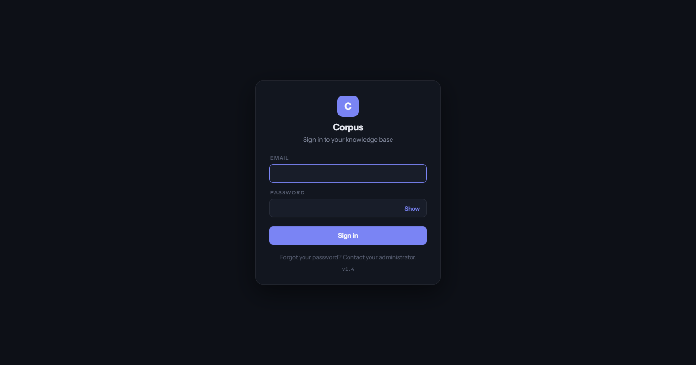
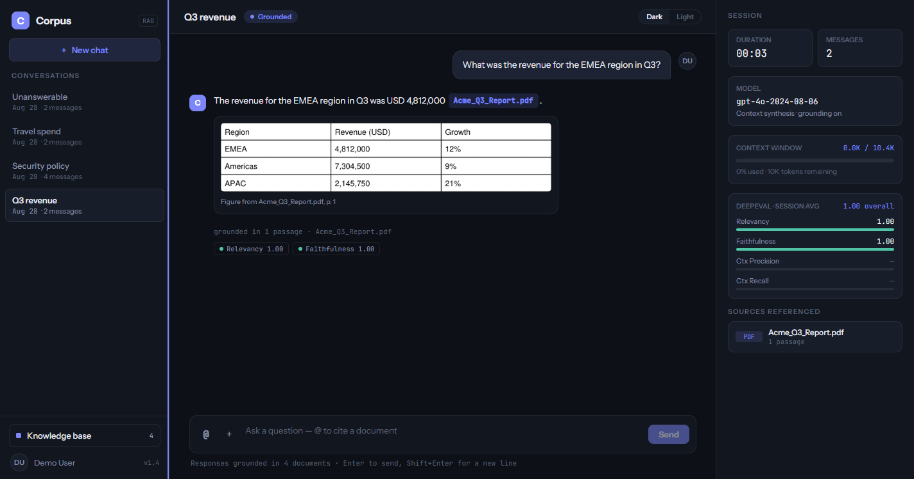
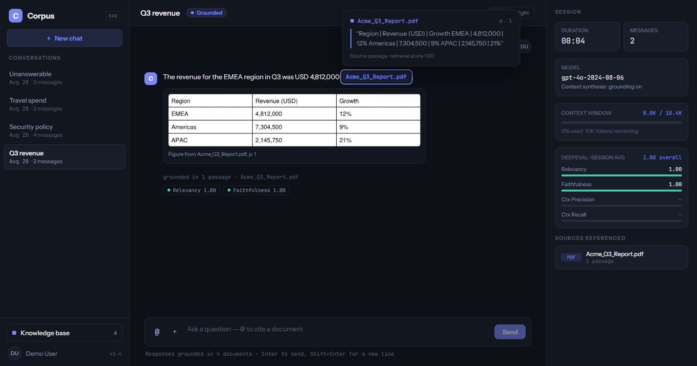
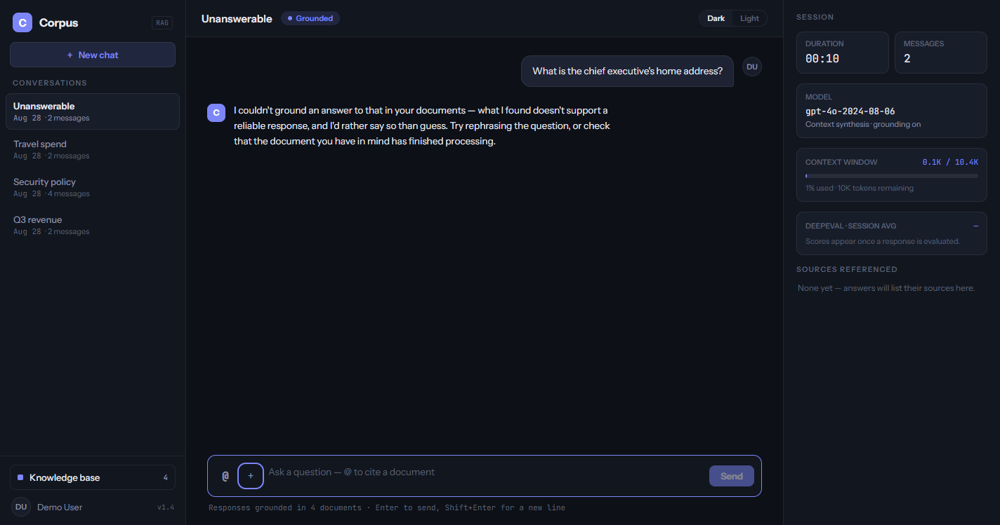
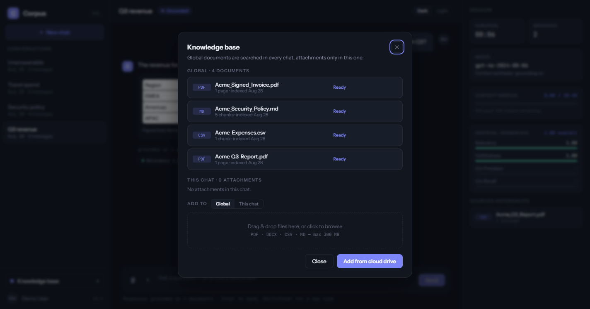
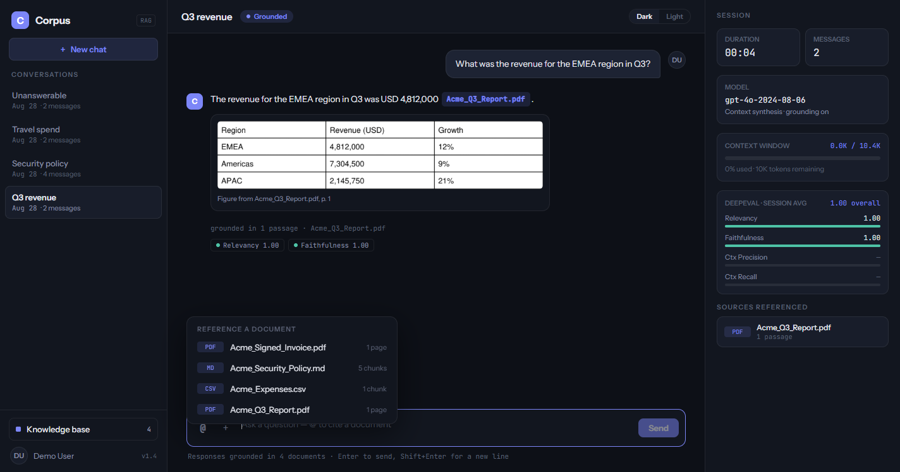
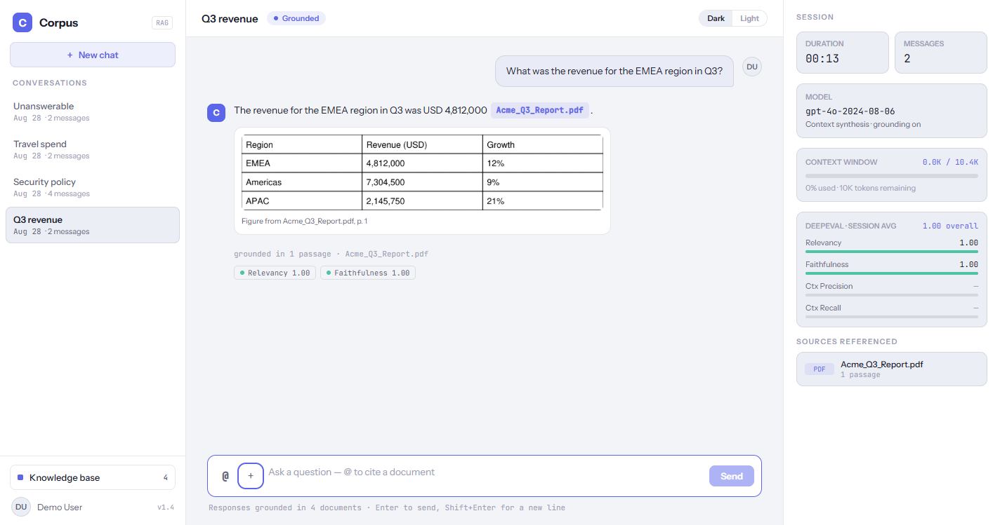
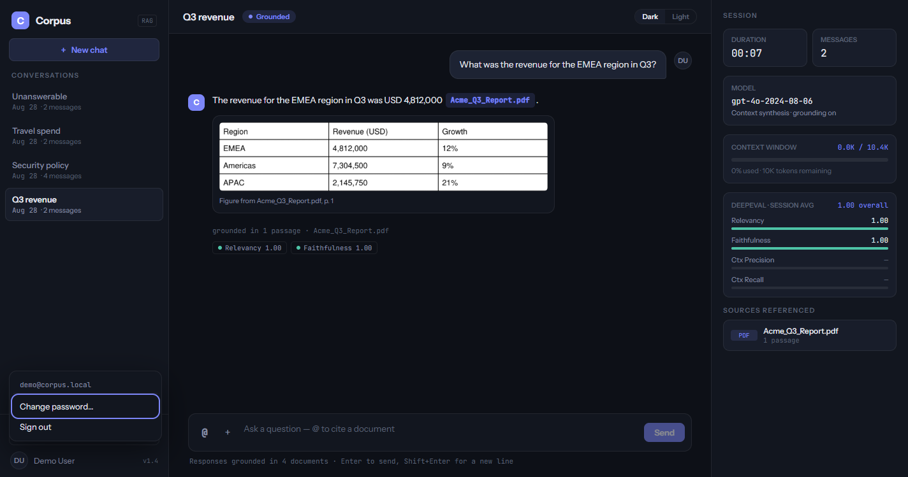
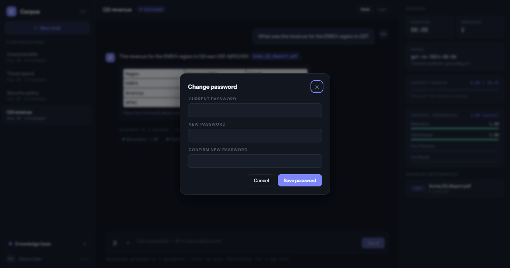

# Corpus — user guide

Corpus answers questions from documents **you** have given it, and shows you where each answer came
from. This guide walks through the things you will actually do, in roughly the order you will first
do them.

Screenshots come from the demo corpus that `tools.seed_demo` creates, so you can reproduce every one
of them. Regenerate them with `npm run docs:shots` — see [DEVELOPMENT.md §7](DEVELOPMENT.md).

- [Signing in](#signing-in)
- [The screen at a glance](#the-screen-at-a-glance)
- [Asking a question](#asking-a-question)
- [Reading a citation](#reading-a-citation)
- [When Corpus cannot answer](#when-corpus-cannot-answer)
- [Rating and regenerating an answer](#rating-and-regenerating-an-answer)
- [Adding documents](#adding-documents)
- [Attaching a document to one chat](#attaching-a-document-to-one-chat)
- [Pointing a question at one document](#pointing-a-question-at-one-document)
- [Importing from a cloud drive](#importing-from-a-cloud-drive)
- [Reading the session panel](#reading-the-session-panel)
- [Switching theme](#switching-theme)
- [Your account](#your-account)

---

## Signing in

Enter the email address and password your administrator gave you. There is no self-service sign-up
and no password reset link: accounts are created by an administrator, and the screen says so —
*"Forgot your password? Contact your administrator."*

Two messages you may see:

- **"Invalid email or password."** — the credentials did not match. The message is deliberately the
  same whether the address exists or not.
- **"Too many attempts — try again later."** — repeated failures temporarily lock the account. Wait,
  or ask an administrator.

If your session expires while you are working, you are returned here with **"Session expired —
please sign in again."** Nothing you sent is lost; your conversations are saved as you go.

---

## The screen at a glance

Three columns, and they do not change:

| Column | What it holds |
|---|---|
| **Left** | Your conversations, newest first, and the **Knowledge base** button with a count of your documents |
| **Middle** | The conversation itself, and the box you type into |
| **Right** | What this conversation has used and cited — see [the session panel](#reading-the-session-panel) |

The **Grounded** badge beside the conversation title is the promise this product makes: answers come
from your documents, not from the model's own memory.

---

## Asking a question

Type into the box at the bottom and press **Enter**. **Shift+Enter** starts a new line — useful when
you are pasting something long. The footer under the box says the same thing, and tells you how many
documents are currently searchable.

While the answer is being prepared you will see a typing indicator. A question usually takes a few
seconds, because Corpus searches your documents, re-reads the best passages, writes an answer and
then checks that answer against the passages before showing you anything.

**You will not see a half-written answer.** That is deliberate: an answer is shown only once it has
passed the grounding check.

---

## Reading a citation

Every claim that comes from a document carries a chip with the document's name. Hover it, or move to
it with the keyboard, and the passage the answer used appears:

The card shows four things: the **document**, **where in it** the passage is (`p. 1` here; a section
heading for Word and Markdown files, a row range for spreadsheets), the **passage itself**, and a
**retrieval score**.

Where the cited page carries a picture, table or chart, it is shown beneath the answer with a caption
naming the page it came from — the table in the screenshot above is lifted from page 1 of the report.

The **grounded in *n* passages** line beneath an answer lists every document it drew on.

> A citation is a claim you can check. If an answer has no chips, it is not grounded in your
> documents — and Corpus will normally have refused to give it at all.

---

## When Corpus cannot answer

If your documents do not support an answer, Corpus says so rather than guessing:

> I couldn't ground an answer to that in your documents — what I found doesn't support a reliable
> response, and I'd rather say so than guess. Try rephrasing the question, or check that the document
> you have in mind has finished processing.

This is the product working, not failing. Three things to try:

1. **Rephrase.** Use words that would appear in the document itself.
2. **Check the document is ready.** Open the knowledge base; a document still processing cannot be
   searched yet.
3. **Check it is in scope.** A document attached to a *different* chat is not searched here.

Some deployments additionally offer an **Answer from general knowledge** button on a refusal. It asks
the model to answer from its own training instead. That answer is clearly labelled, carries **no
citations**, and is never scored — treat it as you would any unsourced answer. If you do not see the
button, your administrator has not enabled it.

---

## Rating and regenerating an answer

Hover an answer to reveal three controls:

- **👍 / 👎** — tell us whether the answer was useful. Click again to clear it.
- **Regenerate** — ask the same question again. The new answer **replaces** the old one, along with
  its citations and its rating, and this cannot be undone. Only the most recent answer can be
  regenerated.

---

## Adding documents

Click **Knowledge base** at the bottom left.

Drag files onto the drop zone, or click it to browse. Corpus accepts **PDF, DOCX, CSV and Markdown**,
up to **300 MB** each.

Each document shows its state. **Ready** means it can be searched. Anything else — *Queued*,
*Parsing*, *Chunking*, *Embedding*, *Indexing* — means it is still being processed; large documents
take longer. **Failed** means it could not be read, and offers a **Retry**.

Some things worth knowing:

- **Uploading the same file twice does nothing.** Corpus recognises the content, not the filename.
- **Deleting a document removes it from future answers**, but answers already given keep the passages
  they quoted, so an old conversation still makes sense.
- **Replacing** a document keeps the old version answering until the new one has finished processing.

---

## Attaching a document to one chat

The **ADD TO** control above the drop zone chooses where an upload goes:

- **Global** — searched in *every* conversation. The default.
- **This chat** — searched only in the conversation you are in.

Use *This chat* for something relevant to one piece of work. The modal lists the two groups
separately, so you can always see which is which.

---

## Pointing a question at one document

Type `@` in the message box, or click the **@** button, to pick a document:

A question with a mention searches **only** the documents you named. This narrows the search; it
cannot widen it, so mentioning a document you do not have access to finds nothing rather than
reaching it.

Keep typing to filter. Use ↑ and ↓ to choose, Enter to insert. Pressing Enter *without* choosing
sends your question, as usual.

---

## Importing from a cloud drive

**Add from cloud drive** in the knowledge base imports from Google Drive. The first time, you will be
sent to sign in and grant access; afterwards you get a searchable list of your files.

An import is a **one-time copy**. The file is brought into Corpus and processed exactly like an
upload — the same formats, the same size limit, the same states. Corpus does not keep reading your
Drive, and disconnecting the account later does not remove documents you already imported.

If you see **"Reconnect"**, the link has lapsed or access was withdrawn at the provider. Reconnecting
restores it.

---

## Reading the session panel

The right column describes the conversation you are in — nothing else.

| Card | Meaning |
|---|---|
| **Duration / Messages** | How long this conversation has been open, and how many messages it holds |
| **Model** | The model answering |
| **Context window** | How much of the conversation's budget is used. A conversation has a finite length |
| **DeepEval** | Quality scores for the answers in this chat |
| **Sources referenced** | Every document cited here, and how many passages came from each |

**About the scores.** They are produced by a model judging a model, and they are *indicative rather
than exact* — the tooltip says so. Use them to notice a weak answer, not as a measurement. Two of the
four rows (*Ctx Precision*, *Ctx Recall*) always show `—`: they need a known-correct answer to
compare against, which a live question does not have.

**When a conversation fills up.** The context window has a limit. As you approach it Corpus warns
you, and at the limit it stops accepting new questions in that conversation. Everything already there
stays readable and its citations keep working — start a **New chat** to carry on.

---

## Switching theme

**Dark** and **Light**, top right. Your choice is remembered on this device.

---

## Your account

Your name at the bottom of the sidebar opens the account menu.

**Change password…** asks for your current password and the new one twice:

If the two new entries differ you will see **"Passwords don't match."** If the current password is
wrong, the change is refused and you stay signed in.

**Sign out** ends the session on this device.

---

## Getting help

- Something is broken, or a document will not process → your administrator; what they can do
  about it is in [ADMIN_GUIDE.md](ADMIN_GUIDE.md), and the operational detail in
  [DEPLOYMENT.md](DEPLOYMENT.md).
- What Corpus deliberately does *not* do → [LIMITATIONS.md](LIMITATIONS.md).
- How answers are produced → [ARCHITECTURE.md](ARCHITECTURE.md).
